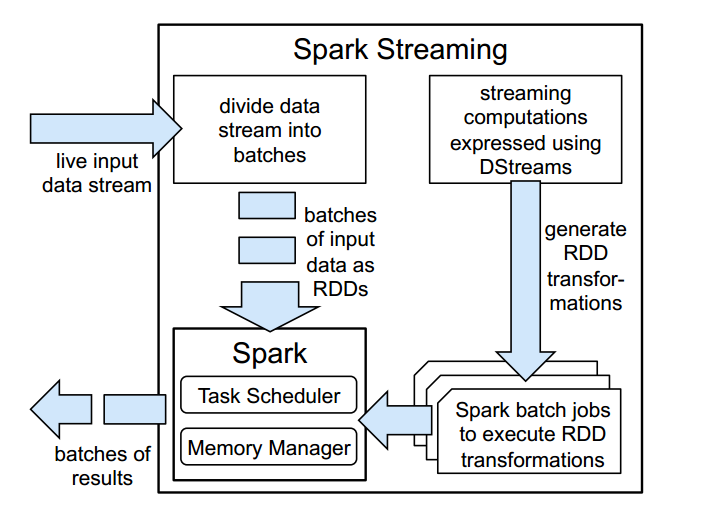
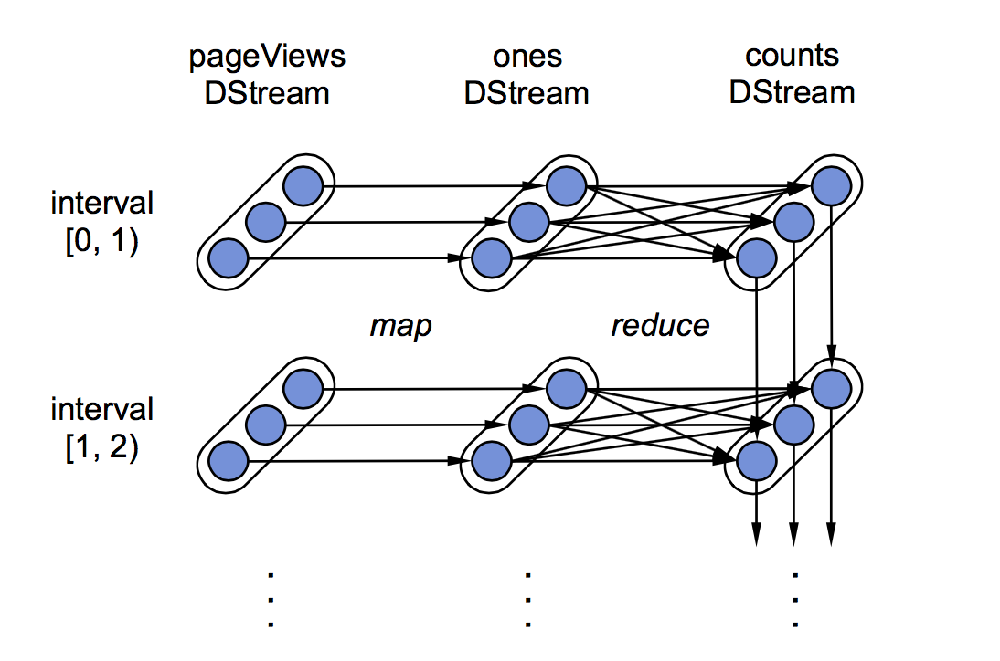

`D-Streams`通过将计算构造为一组*短的*，*无状态的*，*确定性的*任务代替连续的、有状态的操作来避免传统流处理的问题。然后通过容错的数据结构（`RDD`）来将状态保持在内存中，用于重新计算状态。
将计算分解成短任务并暴露其细粒度的依赖性并允许像并行恢复和推测（`speculate`）这样强大的恢复技术。除了容错，`D-Stream`还模型提供了其他好处，比如与批处理相结合。



图4.2是`Spark`流系统的高级概述。`Spark Streaming` 把输入数据流分成批，并将它们存储在`Spark` 内存中，然后生成`Spark`作业来处理每个批次数据。

# 计算模型

我们把流计算看作在一小段时间范围内的一系列确定性的批计算。对于每个时间范围的数据，在集群中存储成一个可靠的数据集。一旦时间范围的数据准备好，这些数据可以通过确定的并行操作，如`map`、`reduce`、`group by`，去
产生新的数据集，这个新的数据集表示输出数据或者中间状态。对于前面的情况，结果可以以分布式的方式推送到一个外部系统。在后面的情况中，中间状态可以通过弹性分布式数据集（RDDs）的高效的存储，
这样可以避免使用`lineage`进行恢复而产生的冗余。该状态数据集可以与下一批输入数据一起处理，以产生一个新的数据集来更新中间状态。图 4.1.b展示了我们的模型。

我们基于这样的模型实现了我们的系统-`spark streaming`，我们用`spark`作为我们的批处理引擎处理每一批数据。 图4.2大致描绘了 Spark Streaming 上下文中的计算模型，后续我们会作更详细的解释。

在我们的API中，用户通过操作我们称之为离散流（`D-Streams`）的对象来定义程序。一个`D-Streams`是一个可变的、分区的数据集（`RDD`）的序列，我们可以通过确定的转换对它进行操作。这些转换可以得到一个
新的`D-Streams`，并可以以RDD的形式创建中间状态。

我们通过一个计算URL访问次数的spark streaming程序来证明我们的想法。。类似于`LINQ`【115,3】，`Spark Streaming`通过Scala语言的可编程的API暴露`D-Streams`。我们的程序代码如下所示：

```scala
pageViews = readStream("http://...", "1s")
ones = pageViews.map(event => (event.url, 1))
counts = ones.runningReduce((a, b) => a + b)
```



图4.3展示了`view count`程序里 RDDs的`lineage`。每个椭圆代表一个 RDD，分区用圆圈表示。每个RDDs的序列是一个`D-Stream`。

这段代码通过`HTTP`读取一个事件流并将它们以一秒的时间间隔来分组，创建一个名叫*pageViews*的`D-Streams`。然后将这个事件流转换为一个通过`（URL，1）`键值对表示的新的`D-Stream`，最后
通过一个状态相关的`runningReduce`转换来对他们进行计数操作。传入`map`和`runningReduce`的参数是`Scala`的函数字面量。

为了执行这个程序，`Spark Streaming`接收数据流，然后将其划分成秒级的批数据，存储在`Spark`的`RDDs` 内存中（见图 4.2）。同时，他也会调用RDD的转换操作如`map`和`reduce`来对RDD进行处理。
为了执行这些转换，`Spark`首先会启动`map`任务来对这些事件进行处理，以生成`(url,1)`计数对。然后，它会启动reduce任务处理`map`的结果以及之前时间间隔内`reduce`操作得到的结果，将最后结果存储在RDD中。
这些任务会产生一个更新计数的新RDD。程序中的每个`D-Stream`因此变成了一组RDD序列。

最后，为了恢复错误和慢任务，`D-Streams`和RDDs要跟踪他们的`lineage`，即用于生成他们的确定性的操作图。在每一个分布式数据集中，Spark会在分区的层面跟踪这些信息，如图4.3所示。
如果一个节点任务失败，它会通过重新运行构建它们的任务来计算相应的RDD分区。这个系统还周期性的`Checkpoint` RDD的状态（例如通过异步的方式对每十个RDD进行复制）以避免大量的重算。
但是不需要对所有数据都进行那样的操作，因为恢复总是很快：丢失的分区可以在不同的节点上并行计算。同理，当一个节点运行缓慢时，因为总会产生同样的结果，我们可以在其他节点上对任务的副本进行推测执行【36】。

我们发现在`D-Streams`中并行恢复比在向上备份中具有更高的可用性，即使每个节点上执行了多个操作。`D-Streams`在分区和时间上都展示了并行性。

- 1 和每个节点执行多个任务的批处理系统非常相似，每个节点在一个转换的每个时间段都可能产生多个RDD分区（例如100核的集群产生1000个RDD分区）。当节点出现故障时，我们可以在其它节点以并行方式重新计算该分区。
- 2 lineage 图通常可以使数据从不同的时间片并行地进行重建。如图4.3所示，如果一个节点出错，我们可能丢失一些时间片的map的输出，这些时间片的map任务可以并行的重新执行。在一个连续处理的系统中是无法实现这样的功能。

依赖这些特性，当每30秒建立一次检查点时，`D-Streams`仅用1-2秒就可以在数百个核上并行恢复。

我们将在本节的剩余部分更详细地介绍`D-Streams`的可靠性和编程接口。并在4.4.节中讨论如何实现。

# 时序性考虑

注意，`D-Streams`按每个记录到达系统的时间存入输入数据集。这样做可以确保系统总是可以及时开始一个新的批次，尤其是在那些记录从相同的地方里产生的应用中，例如同一个数据中心的服务产生的数据，以
这样的方式分割处理，在语义上不会产生错误。而在其他应用中，开发者可能希望基于事件发生的外部时间戳将记录分组，例如，基于用户点击某一个链接的时间，而这样的数据可能是无序的。`D-Streams`提供了两种方法来处理这种情况：

- 1 系统可以在开始处理每个批数据时等待一个有限的"空闲时间"；
- 2 用户程序可以在应用级上对晚到的记录进行修正。例如，假设一个应用希望统计时间t到时间t+1的广告点击数。利用以1秒为时间间隔数的`D-Streams`，一旦t+1时刻过去，应用就可以对t时刻与t+1时刻之间接收的点击数进行统计。
然后在以后的时间间隔内，应用可以进一步收集外部时间戳为t到t+1的事件，并更新结果。例如，它可能将基于从t到t+5时间段内收到的记录，在t+5时刻产生一个在[t, t + 1)时间区间的新的计数。这种计算可以用一种有效的增量`reduce`操作
来执行，它会在t+1时刻的计数基础上加上对之后新记录的计数，以避免重复计算。此方法类似于顺序无关处理【67】。

时序性的考虑是流式处理系统所必须面对的，因为任何系统都必须处理外部延时。在数据库领域已经对此进行了详细的研究【67, 99】。一般来说，这些技术都可以通过`D-Streams`来实现，即将计算”离散化“到小批次数据来计算（相同批次的处理逻辑相同）。
因此我们不会在本文中对这些方法做进一步的探讨。


