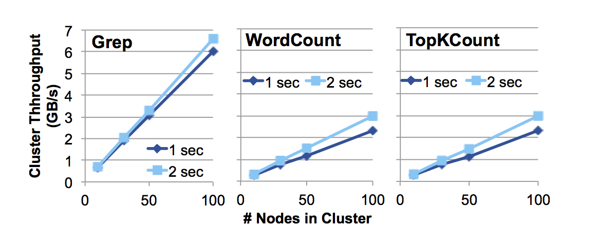
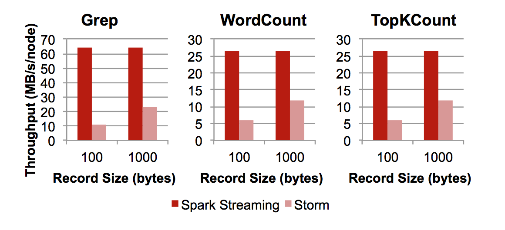
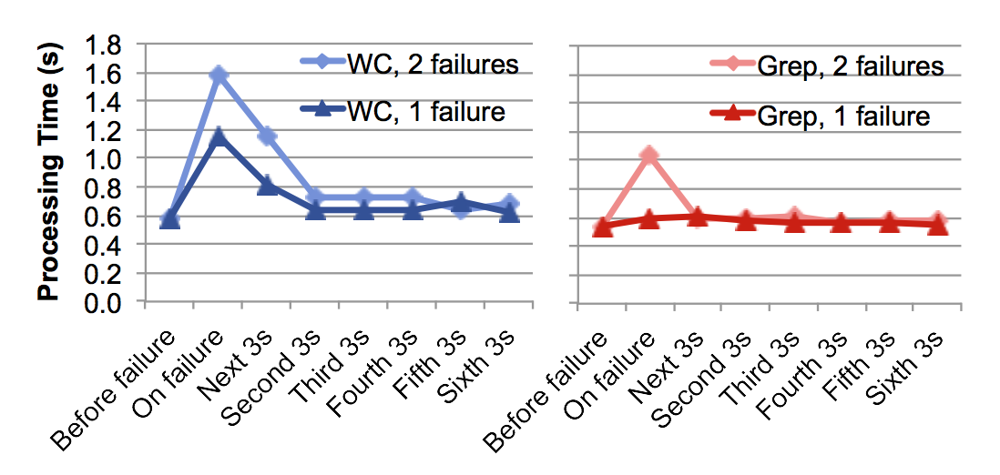
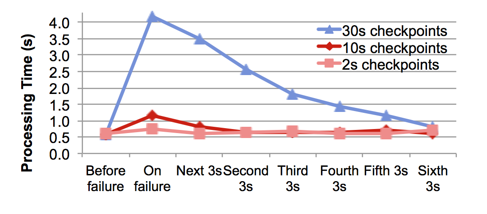
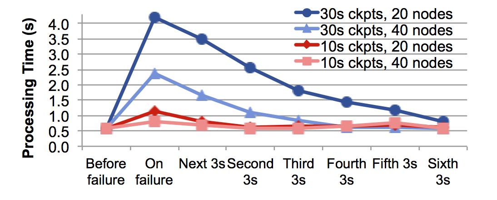
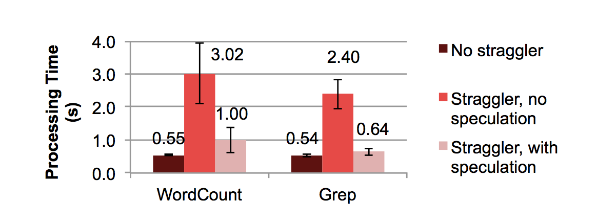
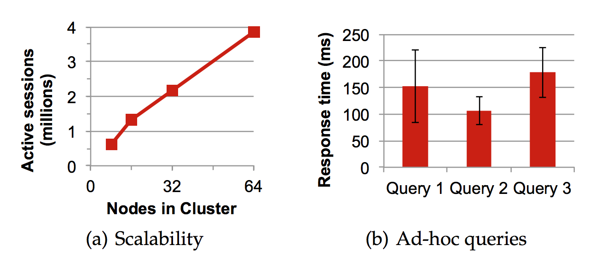
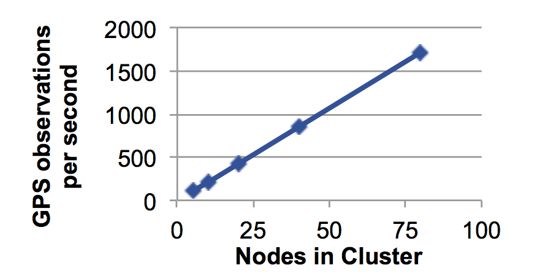

> 我们通过使用多个基准测试应用程序以及两个实际应用来评估`Spark Streaming`。这两个应用是：商业视频分发监控系统和根据汽车的`GPS`数据【57】估算交通状况的机器学习算法。
从这两个案例中，我们也将看到`D-Stream`对批处理任务的良好结合能力，这点会在后文中详细讨论。

# 性能

我们借助三个复杂度依次增加的应用来测试系统性能：
- 1  `Grep`，在输入字符串中查找匹配模式的数量；
- 2  `WordCount`，执行超过30次的滑动窗口计数；
- 3  `TopKCount`，查找K个（超过30次）最频繁出现的词。

后两种应用使用增量`reduceByWindow` 操作。我们首先展示`Spark Streaming`的原始扩展性能，随后将其与`Yahoo! S4`和`Twitter Storm`【78,14】这两种广泛使用
的数据流系统进行比较。这些应用运行于`Amazon EC2`的`m1.xlarge`级节点上，每个节点都带有4个CPU核和15GB内存。

图4.8表明，`Spark Streaming`能在保持端到端延迟低于限定目标的同时，持续地最大化系统吞吐量。这里所说的“端到端延迟”是指记录从系统发出起到得出相应的结果所需的时间。
因此，该延迟包括了等待一个新的输入批次开始的时间。对1秒的延迟目标，我们使用500毫秒的时间间隔输入，而对于一个2秒的目标，我们使用1秒的时间间隔。在这两种情况下，我们使用100字节的输入记录。

图4.8，在给定延迟限制（1秒或2秒）下，`Spark Streaming`可达到的最大吞吐量。

我们看到，`Spark Streaming`可以以近似线性地扩展到100个节点上。对于`Grep`应用，在100节点集群上以亚秒级时延可以处理多达`6GB/s`（`64M记录/s`）。而对于其他更加消耗CPU(CPU密集型)的作业，也可以达到`2.3 GB/s`（`25M 记录/s`）。
若提高可延迟的时间，系统的吞吐量也只是稍有上升。事实上，亚秒级延迟时系统性能已经很高了。

**与商用系统的对比**：`Spark Streaming`的单节点吞吐量在`Grep`上为`640,000条记录/秒`，四核环境下`TopKCount`任务为`250,000记录/秒`。这样的性能能与其他商业化的单节点流系统已公开的性能相媲美。例如，`Oracle CEP`公布的在16核机器上的吞吐量为`100万条记录/秒`【82】，
而`StreamBase` 公布的在8核环境下为`245,000条记录/秒`【105】，`Esper`在四核环境下公开的吞吐量为`500,000记录/秒`【38】。没有理由期望`D-Streams`在每个节点上要更慢或更快，但`Spark Streaming`主要优势在于其性能可以近似线性伸缩到100个节点。

**与S4和Storm的对比**：我们还用`Spark streaming`同两个开源的分布式流系统，`S4`和`Storm`进行了比较。两者都是连续操作的系统，它们不提供节点间的一致性保证，而且容错能力有限(`S4`没有，而`Storm`保证记录至少有一次成功交付)。
我们在这两个系统中编码实现上述三个应用，但发现`S4`上单节点每秒可处理的记录数有限（对`Grep`每秒最多7500条记录，`WordCount`每秒最多1000条记录），这使得它比Spark和Storm至少慢10倍。因为Storm更快，我们在30个节点的集群上，同时使用100字节和1000字节的记录，对它进行了测试。

图4.9 30节点环境下与Storm在吞吐量上的对比。

图4.9 对`Storm` 和`Spark`进行了比较，其中`Spark`是采用亚秒级时的吞吐量。从图中可以看出，记录较小时Storm的性能会降低。对于100字节的记录，`Storm`只达到115K条记录/秒/节点，而`Spark`是670K。这样的结果还是在我们对`Storm`实现进行过性能优化后得出的。
这些优化包括：1. 在`Grep`的实现中，对输入记录采用每100条批量方式发送；2.`WordCount`和`TopK`的对应实现中，是按秒钟来发送新的计数，而不是每次记录发生改变就发送。在1000字节的记录上，`Storm`的速率有所提升，但仍比`Spark`慢2倍。

# 故障和慢节点恢复

对故障恢复能力的评估，将从系统对单词计数(`WordCount`)和查找(`Grep`)两个应用在不同条件下的表现来展开。输入采用的是秒级批处理数据，其原始数据存储在`HDFS`上。
另外，数据传输速率的设定单词计数(`WordCount`)和查找(`Grep`)任务分别为`20MB/s/节点`和`80MB/s/节点`。这样的设定能使得单词计数(`WordCount`)和查找(`Grep`)任务的每次处理的时间近乎相同，具体分别为0.58s和0.54s。
单词计数(`WordCount`)任务执行一个增量式的按键聚合（`ReduceByKey`）的操作，这将使得它的`lineage`不确定的增长（因为每次处理都会去除过去30秒的数据）。因此，这个任务会引入一个大小为10秒的检查点操作。
测试的平台是由20个四核节点构成的集群。每个作业都使用150个Map任务和10个Reduce任务。

图4.10 `WordCount（WC）`和`Grep`任务的故障处理时间间隔。这里展示了处理1秒钟的批量数据时，分别在故障前、故障中和故障后3秒内所需的平均耗时。平均值取自5次运行的结果。

首先，通过图4.10，我们呈现了在上述基本条件下恢复时间的情况。该图展现对于1个或2个并发失败时，系统在故障前、故障中和故障后3秒内，对单秒间隔窗口期数据的平均处理时间。
（在数据恢复时，这些后续处理因为受那些失败的时间区间影响而被延迟，所以我们接下来要展示系统如何再进入稳定状态。）从中可以看到，恢复速度比较理想：即便对于两次失败和10秒的检查点串口情况下，也最多只有1秒的延迟。
单词计数(WordCount)任务中的恢复耗时相对较长。这是因为每次失败时，它需要追溯`lineage`，从更加原始的数据开始重新计算。而查找(Grep)任务则与之相反，每个失败节点上它只丢失了四个任务。

调整检查点时间窗口，图4.11展示了不同检查点时间窗口对`WordCount`的影响。即便检查点窗口为30秒时，结果最多也就延迟3.5秒。窗口设定为2秒时，系统恢复需时仅为0.15秒，这仍然快过全备份的策略。

调整节点数据，为评估并行程度对系统的影响，我们同样在一个40节点的集群上测试了`WordCount`应用。如图4.12所示，节点数目增加一倍会使得恢复时间减少一半。

慢节点恢复 最后，我们通过启动60个线程来过载CPU而不是直接移除的方式，来模拟出一个慢节点。图4.13分别展示了无慢节点时、有慢节点且禁用推测执行(备份任务)时，以及有慢节点且推测执行时，系统的单次处理耗时。预测执行能显著改善相应时间。

需要注意的是， 我们的编码实现中并不记录执行过程中的慢节点有哪些，这样，性能的改善是在可能会多次在慢节点上发起新任务的情况下得到的。这就表明，即便是意外出现的慢节点也能被系统快速处理。一个比较完整的实现是将那些慢节点加入黑名单。

# 实际应用

我们借助两个实际应用来评估`D-Streams`的能力。这两个应用的复杂度都明显高于以上所示的所有测试，并且它们都利用`D-Streams`来进行批处理、交互式处理以及流处理。

## 视频分发监控

`Conviva`推出了一款用于视频在因特网上分发的商业管理平台。该平台中的一个功能是能实现不同地理区域、`CDN`、客户设备和`ISP`下的性能跟踪。这使得广播商能快速发现视频分发过程中的问题，并进行响应。
系统从视频播放器接受事件信息，并利用它来计算不同分类下的50种以上的指标。这些指标包括如观众数，以及某次播放的视频缓冲率这样的复杂指标。

其当前的应用由两部分构成：一个定制的分布式流式系统用于处理实时数据，以及一个基于`Hadoop/Hive`的历史数据和即时(ad-hoc)查询支持系统。由于客户会想回调到某个历史时刻来进行系统调试，故同时支持实时数据和历史数据很重要。
然而，这也增加了在这两个独立的系统之上来实现某个应用的挑战性。首先，两系统之间必需保持同步，以保证他们计算指标的方式相同。其次，在数据导入 Hadoop 转成可供即时查询的形式的过程中，会有数分钟的迟延。

通过将`Hadoop`版本下相应的`Map`和`Reduce`函数进行封装，我们将上述功能移植到了`D-Streams`上。移植的实现包括一个500行的`Spark Streaming`程序和一个700行代码的封装器。该封装器能让`Hadoop`程序在`Spark`下执行，我们能够使所有的`Metrics`(由两个`MapReduce`任务构成)可以在短短2秒内计算完。
代码的实现使用了4.3.3节所述的`updateStateByKey`操作，来对每一个客户端ID构造一个会话状态对象，并在收到事件时对该对象进行更新。而在该操作之后，会有一个滑动的`reduceByKey`过程来对多个会话的`Metrics`进行聚合。

图4.14 视频应用程序的结果，（a）显示支持的客户端会话数目vs集群大小,（b）显示3个从`Spark Shell`程序进行即时查询的性能：（1）所有的活动会话；（2）特定用户的会话；（3）已出现故障的会话。

对该应用的可伸缩性测试表明，在64节点4核`EC2`集群下，能处理足够多的事件来支撑380万的用户同时在线观看。而这个量已经超过了`Conviva`现有的峰值记录。伸缩性测试见图4.14(a)。

此外，我们使用`D-Streams`来添加一个原始应用程序中不存在的新功能：实时流状态的ad-hoc查询。如图4.14（b），`Spark Streaming`可以在不到一秒钟的时间内从`Scala Shell`完成对会话状态的RDD进行的ad-hoc查询。
该集群的内存容量完全可以容下10分钟的数据，而这个长度接近历史数据和流处理之间的时间差。同时，人们可以在一套代码上对这两套数据进行处理。

## 众包交通流量估计 

我们将`D-Streams`应用到`Mobile Millennium`交通信息系统【57】，该系统是一个基于机器学习的用来估算城市的汽车交通状况的系统。测量高速公路上的交通很简单，因为高速公路上有专用的传感器，然而在主干道（城市里的道路）却且缺乏这类设施。
`Mobile Millennium`利用来自装有GPS的汽车（如，出租车）和运行特定程序的手机的GPS众包数据来解决这个问题。

从GPS数据进行流量估算是具有挑战性的，因为GPS数据存存有噪声（在高的建筑物附近GPS有误差）且呈稀疏特性（系统只从每车每分钟接受一次测量）。`Mobile Millennium`通过一个计算复杂的期望最大化算法来做条件推断，
利用马尔科夫链模特卡洛和一个交通流量模型来评估各个路段交通流量随时间的分布情况。

对于每个路径连接。以前的实现【57】是一个迭代式的Spark批处理任务，该任务以30分钟为时间窗来对数据进行处理。

通过一个 EM 在线算法，我们将该应用移植到了`Spark Streaming`。该算法每5秒钟生成新的数据。移植的实现为260行`Spark Streaming`代码，并封装了上述离线程序中的`Map`和`Reduce`函数。此外，我们发现5秒内的数据过于稀疏，从而可能引发过拟合。所以，我们通过利用`D-Streams`来结合过去10天里相同时间段数据的方式，来解决这个问题。

图4.15展示了在80个四核`EC2`节点上这个算法的性能。由于该算法是CPU密集型，其性能几乎能随节点数线性扩展，同时其计算速度为原批处理版本的10倍。

