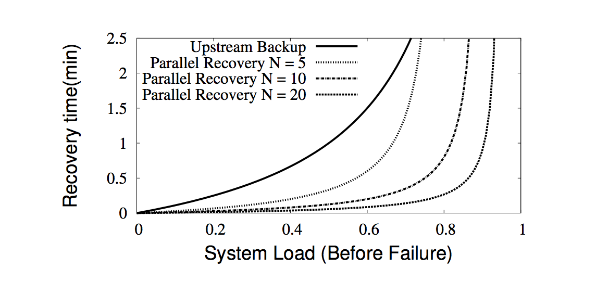
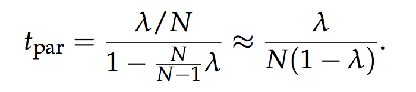

> `D-stream`确定性的特性使它可以对工作节点状态使用两种有用的恢复技术，这两种技术很难用于传统的流式处理系统。这两个技术是：并行恢复和预测执行。此外，它也简化了主节点的恢复，我们接下来会讨论这些。

# 并行恢复

当一个节点失败，`D-Streams`允许节点上的RDD分区的状态以及运行中的所有任务在其它节点上并行的执行。系统通过并行复制RDDs的状态到其它工作节点来周期性的`checkpoints`一些Rdds的状态。
例如，在统计页面浏览数的程序中，系统可以对该统计每分钟选择一个检查点。然后，当一个节点失败系统会检查所有丢失的RDD分片，然后启动一个任务从上次的检查点开始重新计算。
许多任务可以同时启动去计算不同的RDD分区，使得整个集群参与恢复。如4.3节介绍的那样，`D-Stream`在每个时间片中并行地计算RDDs的分区以及并行处理每个时间片中相互独立的操作（例如最初的map操作）。
因为可以从`lineage`图中细粒度地获得依赖关系。

图4.7 以失败之前的系统负载为函数，对比单点向上流恢复和N个节点并行恢复的恢复时间。我们假设检查点间隔时间是1分钟。

为了展示并行恢复的优势，图4.7使用了一个简单的分析模型将它和单点向上流备份进行了比较。该模型假定系统从一分钟之前的检查点恢复。

在向上流备份这条线中，单个闲置机器执行了所有的恢复，然后开始处理新的记录。在高负荷的系统中这需要很长时间才能跟上进度，这是因为在重建旧的状态的过程中新的记录会持续到达。
实际上，假设在失败之前的工作量是`λ`，然后在恢复的每分钟中备份节点只能做一分钟的工作，但是会同时收到`λ`分钟的新任务。因此，要在tup的时间内从上次失败结点中完全恢复`λ`个单元的任务。
`tup · 1 = λ + tup · λ`。

在其它的线中，所有的机器都参与了恢复，同时也处理了新的记录。假定在失败前集群中有`N`台机器，剩余的`N - 1`台机器，需要恢复`λ/N`个工作，同时需要以`N*λ/(N-1)`速率接收新数据。
它们追赶当前数据流的时间`tpar`满足`tpar • 1 =λ/N+tpar*Nλ/(N-1)`。 

因此，拥有的节点更多，并行恢复跟上当前数据流就比向上流备份更快。

# 降低慢节点影响

除了节点故障，在大型集群中另一个值得关注的问题是慢节点问题【36】。幸运的是，`D-stream`同样也可以让我们像批处理系统那样减少较慢节点的影响，这是通过推测（`speculative`）地运行较慢任务的备份副本实现的。
这种推测执行在连续的处理系统中可能很难实现，因为它需要启动一个结点的新副本，填充新副本的状态，并追赶上较慢的副本。事实上，流式处理中的复制算法， 比如`Flux`和`DPC`【93,18】， 主要在于研究两个副本之间的同步。

在我们的实现中，我们使用了一个简单的阈值来检测较慢的节点，如果一个任务的运行时长比它所处的工作阶段中的平均值高`1.4`倍以上，那么我们标记它为慢节点。我们将来也可能会采用更精细的算法，但是我们看到目前的方法仍然工作的很好，
它能够在1秒内从较慢节点中恢复过来。

# 主节点恢复

不间歇运行`Spark Streaming`的一个最终要求是能够对主节点容错。我们通过两个步骤来做到这些。

- 当开始每个时间间隔时可靠地记录计算的状态。
- 当旧的master失败时，让计算节点连接到一个新的master并且报告他们的RDD分区。

`D-streams`的一个核心方面是*如果一个给定的RDD被计算两次是没有问题的*。因为操作是确定的，这一结果与从故障中进行恢复类似。因为任务可以重新计算，这意味着当master重新连接时丢掉一些运行中的任务也是可以的，因为它们可以被重新计算。

我们目前的实现方式是将`D-Stream`元数据存储在`HDFS`中，记录以下三种信息：

（1）用户的`D-Streams`图以及表明用户代码的Scala的函数对象

（2）最后的检查点的时间

（3）自检查点开始的RDD的ID号。其中检查点通过对每个时序进行重命名（原子操作）来更新`HDFS`文件。

恢复后，新`master`会读取这个文件找到它断开的地方，并重新连接到计算节点，以便确定哪些RDD分区是在内存中。然后再继续处理每一个漏掉的时序。虽然我们还没有优化恢复处理，但它已经相当快了，100个节点的集群可以在12秒内恢复。

