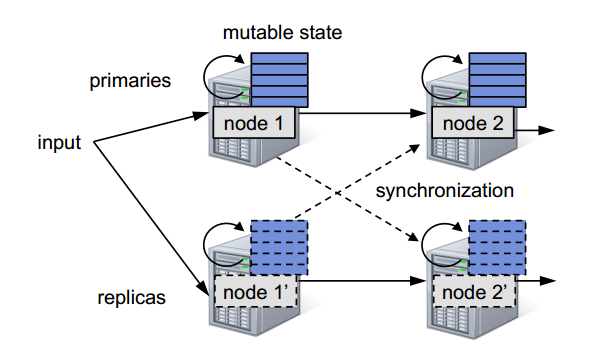
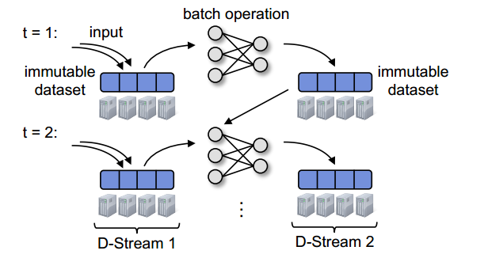

在显示生活中，许多重要的应用都要处理大规模的流数据。我们的工作目标是需要运行在数十到数百台机器上的应用程序能够在几秒内响应。一些例子如下：

- **网站活动统计**：`Facebook`建了一个分布式聚合系统，名为`Puma`, 这个系统用于为广告商提供过去10-30秒内用户点击它们网页的统计信息，它每秒处理100万个事件。
- **集群监控**：数据中心操作者时常收集程序日志用来发现问题，例如使用上百个节点的`Flume`系统。
- **垃圾探测**：一个社交网络例如`Twitter`可能希望利用统计学学习算法【102】实时识别一个新的垃圾活动。

对于这些应用，我们相信`D-Streams`的延迟在0.5-2秒是可以满足要求的，因为它远低于趋势监控的时间刻度。我们的目标不是需要几百毫秒延迟的应用程序，例如高频率交易。

# 目标

为了在大规模的范围上运行这些应用，我们寻找一个系统设计满足4个目标:

- 1 可扩展到几百个节点
- 2 在基本操作的基础上最小化花费-例如，我们不希望两个副本。
- 3 秒级别的延迟
- 4 从错误和`stragglers`中秒级别的恢复

在我们的认知中，之前的系统不能达到这个目的，副本系统花费太高，向上流备份会花费数十秒来恢复丢失的状态。并且它们不能处理`stragglers`。

# 之前的处理模型

虽然在分布式流处理中做了很多工作，但是大部分之前的系统都使用了相同的连续操作模型。在这样的模型下，流计算被划分为一组长期存在的有状态的算子。各算子处理接收的数据并更新它们的内部状态（(比如一个统计某个时间段内页面浏览次数的表）
，然后返回新的记录【29】。图4.1.a描述了这个过程。

上图即连续操作处理模型。每个节点连续地接收数据、更新内部状态并且输出新的记录。容错一般来说是通过复制数据来实现的，用类似于 `Flux` 或 `DPC`【93, 18】的同步协议来确保副本数据在每个节点看来都是相同的顺序(例如, 当它们有多
个父节点时)。

上图即为`D-stream`处理模型。在每个时间间隔内到达的数据被可靠的存储在集群中，形成一个不可变的分区的数据集。之后，这个数据集通过确定性的并行操作，计算其他的分布式数据集。
这些数据集作为下一个间隔里的输入或者状态。每个系列里的数据集构成一个`D-Stream`。

虽然连续的处理最小化延迟，但是有状态的算子以及由于网络传输记录造成的不确定性使它很难提供有效的容错。具体来说，恢复的最大挑战在于在丢失节点或慢节点上重建操作的状态。之前的系统使用两种方案中的一种：复制或向上流备份【58】。
这并不能在恢复的开销和时间之间进行良好的平衡。

在复制模型中-这种模型是数据库系统中常用的模型，处理流程图会有一个备份，输入数据会同时分发给它们。然而，只是对节点做备份并不够，系统还需运行一个诸如`Flux`【93】 或者`Borealis's DPC`【18】那样同步协议，
来保证每个操作(含备份的)会以相同的顺序来对待上游发来的消息。例如，一个输出两个父数据流的联合操作，需要确保父运算流顺序相同，才能得出相同的输出流，所以操作的几份拷贝之间需要协调。复制方案虽然可以很快恢复，但是耗费大量资源。

在向上流备份模式中，每个节点在检查点处保存其所发出消息的副本。当一个节点失败之后，备用节点马上充当失败节点的角色，父运算流会重新发送信息给备用节点来重建状态。这种方法需要花费大量的时间恢复，
因为通过运行一系列带状态的操作来重新计算出丢失的状态只能在同一个节点上进行。`TimeStream`【87】和`MapReduce Online`【34】使用这个模型。流行的消息队列系统，如`Storm`，也使用这种模式，它
保证“至少一次”发送消息，依赖用户代码来处理状态恢复。

更重要的是，复制和向上流备份模式都不能应对慢节点(`straggler`)问题。在复制模式下，如果一个节点运算很慢，为了确保复制能够保持同序，整个系统都会很慢。在向上流备份模式下，处理慢任务的唯一方法就是标记任务为失败，
这就需要经历前面所提到的缓慢的状态恢复过程，对于偶尔发生的错误，这种方法是太过笨重。因此，传统的流方法在小规模环境中工作良好，但是在大规模集群中会面对大量问题。

