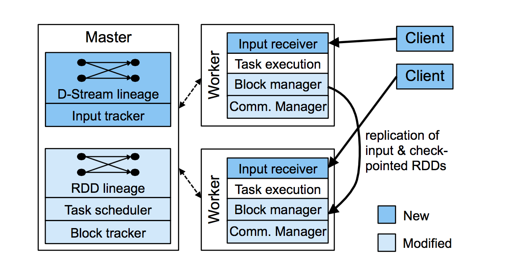

我们已经在`Spark Streaming`中实现了`D-Stream`，它是基于Spark处理引擎的一个修改版本。`Spark Streaming`由三部分组成，如图4.6所示：

图4.6，`Spark Streaming`组件，显示了我们在Spark原版本上所作的修改。

- 一个master跟踪`D-Stream` 血统图，并且调度任务产生新的RDD 分区。
- 工作节点接收数据，保存输入的分区和已计算的RDD，并执行任务。
- 一个客户端库用来发送数据给系统。

如上图所示，`spark streaming`重用了spark的很多组件，也同时添加和修改了几个组件从而适应流式处理。我们将在4.42节讨论这些改变。

从架构图可以看出，`Spark Streaming`和传统的流式处理系统的不同是，`Spark Streaming`将计算分解成小的、无状态的、确定的任务。每个任务都可以运行在集群的任何节点上，
甚至多个节点上。在传统系统的固定拓扑结构中，将部分计算过程转移到另一台机器是一个很大的动作。`Spark Streaming`可以非常直接地在集群上进行负载均衡，应对故障或启动慢节点恢复。
基于同样地原因，这种方法也可以用于批处理系统，如`Map-Reduce`。然而，`Spark streaming`的任务非常短，因为其运行在内存中，所以通常只需要50ms到200ms。

`Spark Streaming`的所有状态都存储在容错数据结构RDD中，而不是先前系统中长任务操作处理过程的一部分。由于RDD分区被确定性地计算出来，它可以驻留在任何节点上，甚至可以在多个节点上进行计算。
这个系统尽量将状态和任务放在本地以最大化数据本地化，同时这种潜在的灵活性使得推测执行和并行恢复成为可能。

这些优势来自于我们运行任务在批处理系统（`spark`）上，但是我们仍然需要做出显著的改变来支持流式处理。在介绍这些修改之前，我们先讨论任务执行的更多细节。

# 应用程序执行

`Spark Streaming`应用程序以定义一个或者多个输入流开始。系统既可以直接从客户端接收数据来加载流，也可以从外部存储系统，如`HDFS`，中周期性的加载数据。在前面的方式中，我们要确保新的数据
在发送一个确认到客户端库之前，新的数据可以两个工作节点间复制，这是因为`D-stream`需要输入的数据被可靠地进行存储来重新计算结果。

所有的数据在每一个工作节点上被一个块存储（*block store*）进行管理，同时利用主服务器上的跟踪器来让各个节点找到数据块的位置。因为于我们的输入数据块和我们从数据块计算得到的RDD的分区是不可变的，
因此对块存储的跟踪是相对简单的。每一个数据块只是简单的给定一个唯一ID，并且所有拥有这个ID的节点都能够对其进行操作（例如多个节点计算它）。块存储将新的数据块存储在内存中，并且会以`LRU`策略将这些数据块丢弃，这在后面会进行描述。

为了决定什么时候开始处理一个新的时间段，我们假设各个节点通过NTP进行了时钟同步。在每个时间段结束时，每个节点会向master发送它们接收的块IDs。主服务器之后会启动任务来计算这个周期内的输出RDDs，不需要其它更进一步的同步。
和其它批处理调度【61】一样，一旦完成上个任务，它就简单地开始后续任务。

`Spark Streaming`的每个时间阶段都依赖于spark现有的批处理调度。并加入了像`DryadLINQ`【115】系统中使用的大量优化。

- 它对一个单独任务中的多个操作进行了管道式执行，如一个map操作后紧跟着另一个map操作。
- 它根据数据的本地性对各个任务进行调度。
- 它对RDD的各个分区进行了控制，以避免在网络中`shuffle`数据。例如，在`reduceByWindow`操作中，每一个周期内的任务需要从当前的周期内“增加”新的部分结果（例如，每一个页面的点击数），和“删除”多个周期以前的结果。
调度器使用相同的方式对不同周期内的状态RDD进行切分，以使在同一个节点的每一个key的数据(例如,一个页面) 在各时间分片间保持一致。

# 流处理优化

虽然`Spark Streaming`是建立在spark之上的，但是我们必须做出一个显著的改变来使批处理系统支持流式处理。这些改变包括：

**网络传输**：我们重写了`spark`数据层，它使用同步IO使那些带有远程输入的任务，如`reduce`任务，可以更快的获取输入。

**时间间隔管道**：因为每一个时间周期内的任务可能没有充分地使用集群的资源（在时间周期的结尾，可能只有很少的几个任务还在运行）。我们修改了Spark的调度器，使它允许在当前的时间间隔还没有结束的时候调用下一个时间间隔的任务。
例如，在表4.3提到的`map + runningReduce`作业。我们之所以能够在时间间隔1的reduce操作结束之前就可以执行时间间隔2的map操作，是因为每一步map操作都是独立的。

**任务调度**：我们使用多个优化器优化spark的任务调度，比如说手工调整控制消息的大小，使得每隔几百毫秒就可以启动上百个任务的并行作业。

**存储层**：我们重写了spark的存储层以支持RDDs并行`checkpoint`，用来提高效率。因为Rdds是不可变的，所以可以在不阻塞计算和减慢作业的情况下，通过网络对RDDs设置检查点。
。在可能的情况下，新的数据层还会使用零拷贝。

**Lineage cutoff**：因为`D-stream`中Rdds之间的血统图可以无限制增长，所以我们修改调度器，当一个RDD设置检查点之后删除自己的`lineage`，这样它的状态就不可能任意增长。
同理，对于Spark中的其它无限增长的数据结构来说，将会定期调用一个清理进程来清理它们。

**主节点恢复**：因为流应用需要不间断运行，我们给Spark加入对主节点状态恢复的支持。

好玩的是，针对流处理所做的优化同时还提高了Spark在批处理标准测试上的性能，大概是之前的2倍。Spark的引擎能够同时应对流处理和批处理，这是其强大之处。

# 内存管理