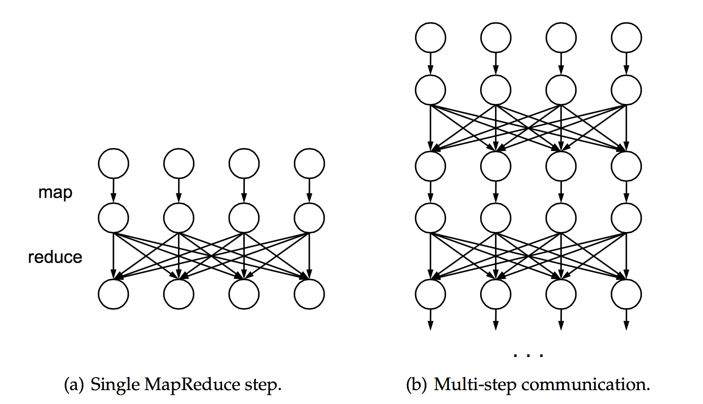

为了从理论的角度描述`RDD`的表现力，我们拿`RDD`与`MapReduce`模型进行比较，`MapReduce`模型是`RDD`模型的基础。MapReduce 最初是被用于大规模集群的计算，从 SQL【104】到机器学习【12】，但是逐渐被其他特定系统取代。

# `MapReduce`可以处理哪些计算

我们关注的第一个问题是`MapReduce`可以表达（`express`）哪些计算。尽管有很多`MapReduce`局限性的讨论并且有很多系统扩展了它，令人惊奇的答案是*`MapReduce`可以模拟任何分布式计算*。

注意，任何分布式系统都由节点的本地计算和偶尔的消息交换组成。`MapReduce`提供了`Map`操作-它允许本地计算，`Reduce`操作-它允许所有节点之间的通讯。因此，任何分布式系统都可以模拟（可能有一些不高效）。
`MapReduce`将计算分解为多个时间步长（`timestep`），在每个时间步长中，用`Map`执行本地计算，并且在时间步长的结尾，进行消息打包和交换。一系列的`MapReduce`步骤足以获得最后的结果。图5.1显示了这些步骤如何执行。

图 5.1。使用 MapReduce 模拟一个任意的分布式系统。如(a)所示，`MapReduce`提供了本地计算以及所有结点相互间通信的原语。如(b)所示，通过将这些步骤链接在一起，我们能够模拟任意的分布式系统。这个模拟的主要代价是每一轮的延迟以及步骤之间状态传递的开销。

