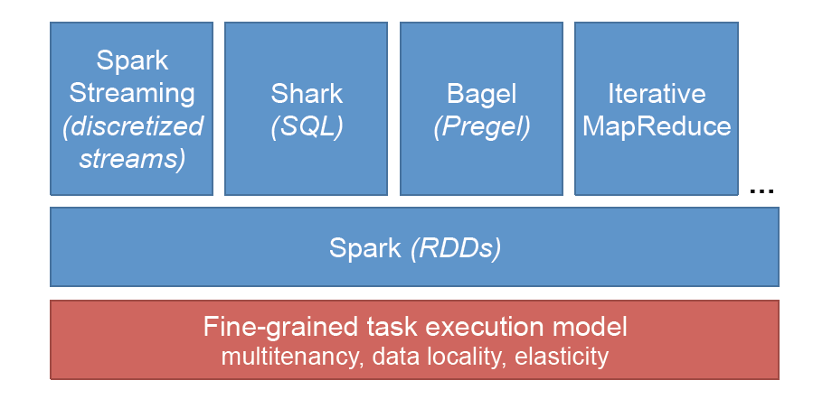

# 1.2　在RDD上实现的模型

我们用`RDDs`实现了一些现有的集群编程模型和那些以前的模型并不支持的新应用程序。在这些模型之中，`RDDs`仅仅去匹及了那些以前系统的性能，但是在其他的模型中，
它们也能够添加新特性，比如容错，慢任务（`stragglers`）容纳和灵活性，这些是当前系统所缺少的。下面我们来讨论四种模型：

**迭代算法**：现如今，专业系统为之不断发展的一个最常见的工作负载是迭代算法，常用于图像处理，数值最优化和机器学习等。`RDDs`可以捕捉各种像这样的模型，包括
`Pregel `【72】、迭代`MapReduce`模型比如`HaLoop `和`Twister `，以及`GraphLab `和`PowerGraph`　【71, 48】模型的一个确定性版本。

**关系型查询**：`MapReduce`集群上的首要要求之一是可以运行`SQL`查询，包括长时间运行、好几个小时的批处理作业和交互式的查询。
这促使了众多在商业集群上应用了并行式数据库设计的系统的发展【95, 60, 75】。然而我们认为`MapReduce`在并行式数据库上的交互式查询方面有着自身固有的缺陷。
比如，由于它的容错模型，我们可以在`RDD`的操作中实现许多常见的数据库引擎的特性（例如，面向列的处理），从而在`RDD`模型上达到了一流的性能。
由此而形成的系统，`Shark  `【113】不仅提供了完善的容错能力，能够伸缩为或长或短的查询，而且也具有调用内置在`RDDs`中的复杂的分析功能（例如机器学习）的能力。

**`MapReduce`**：通过提供`MapReduce`的超集，`RDDs`可以运行一般的基于`DAG`的应用程序（比如`DryadLINQ `【115】），也可以高效的运行`MapReduce`的应用。

**流式处理**：流式处理作为从专业系统的最大分离，我们也使用`RDDs`来实现它。流式处理在数据库和系统的相关方面已经被人们进行了研究，然而大规模的实现却是挑战性的。
如今的模型并不处理在大型集群上经常发生的慢任务（`stragglers`）问题，而且在故障恢复上的途径很有限，会需要昂贵的复制和长长的恢复时间。尤其是，当前的系统
基于连续算子模型，当每个记录到达时这些长期活跃的算子就会去处理。为了恢复一个丢失的节点，它们需要保存每个算子的两个副本，或者重新执行节点上游这一昂贵的连续过程。

我们提出了一种解决了这个问题的新模型，离散化数据流（`D-Streams`）。`D-Streams`不使用长期活跃的流程，它以一个短的、确定性的批量计算序列来执行流式计算，
并且在`RDDs`上存储期间的状态。`D-Streams`模型支持快速的故障恢复，它通过`RDDs`涉及到的依赖图而进行并行式恢复，并不需要复制。此外，通过推断执行，它可以支持慢任务缓解，
比如，推断执行慢任务的备份副本。尽管`D-Streams`由于运行离散的工作任务而增加了一些延迟，我们却认为它们在达到类似之前系统的各节点的性能和线性扩展到１００个节点的的同时，
也可以实现次秒级的延迟。这种强大的恢复特性使它们成为第一种解决大型集群的特性的流式处理模型之一，而且它们在`RDDs`的基础也使得应用程序可以和批处理以及交互式查询强大地组合起来。

**组合这些模型**：通过把这些模型组合起来，`RDDs`也能够支持那些难以在当前系统中表达的新的应用程序。例如，许多流式应用程序也需要把信息和历史数据联合起来；使用`RDDs`，可以把批
处理和流式处理在同一个程序中结合起来，从而获得这两种模型之间的数据共享和故障恢复。同样地，流式应用程序的运算子经常需要在流状态下运行一些特别的查询；`D-Streams`中的`RDDs`可以像静态数据
一样地查询。我们用真正的线上机器学习(第4.6.3节) 和视频分析(第4.6.3节) 的应用程序来举例说明这些用例。更普遍的是，批处理应用程序甚至经常需要把这些处理类型结合起来：比如，一个应用程序可能使用
`SQL`来提取数据集，在它上面训练一个机器学习模型，然后查询这个模型。由于分布式文件系统的`I/O`需要在主导计算的系统之间共享数据，导致这些组合起来的工作流在当前系统中效率低下。
使用一个基于`RDDs`的系统，这些计算能够在相同的引擎中而且不需要外部的`I/O`来双向运行。

如图1.2所示，在`Spark `堆栈和专业系统中比较代码大小和性能。

`Spark `的代码大小类似于专业的引擎，然而这些模型在`Spark `上的实现却小得多。尽管如此，优秀的应用程序上表现的性能是相当的。