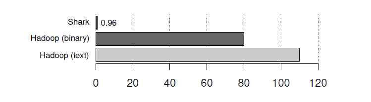
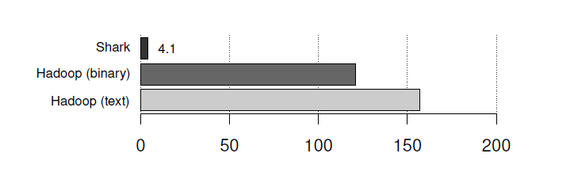

# 3.6 Combining SQL with Complex Analytics

Shark的一个关键设计目标是提供一个能够进行高效的SQL查询处理和高级机器学习的单系
统。遵循将计算接近数据的原则，Shark 将机器学习作为其一级特性。设计决定了选择 Spark
作为执行引擎以及将 RDD 作为操作的主要数据结构。在本节中，我们将介绍 Shark 针对 SQL 和
机器学习在语言和执行引擎上的集成。
其他研究项目已经证明，用 SQL 表达某些机器学习算法和避免将数据从数据库中移出是可
行的[33,41]。然而，这些项目的实现涉及到 SQL，UDF 和用其它语言编写的驱动程序。系统变
得难以理解和维护;此外，为了在传统的数据库引擎上执行代价巨大的并行数值计算，它们可能
以牺牲性能的代价，因为传统的数据库引擎并不是为这项工作设计的。相比之下，shark 提供
了数据库内的分析，将计算接近数据，shark 采取的方法是使用一个运行时和一个编程模型来
实现的，该运行时特别针对这样的工作来优化的，同样的，该编程模型也是被特别设计用来表
达机器学习算法的。

# 3.6.1 Language Integration

语言集成
Shark 复杂的分析能力以两种方式提供给用户。第一种，Spark 程序可以通过调用 Shark 提
供的 Scala API 获取 Shark 数据作为 RDD。然后，用户在 RDD 上进行任何 Spark 计算，并使用
SQL 将它们自动串联起来。第二种，我们还扩展了 SQL 的 Hive 方言，允许在 RDD 上调用 Scala
函数，方便暴露现有的 Scala 类库给 Shark。
作为 scalar 集成的一个例子，清单 3.1 表示一个数据分析的流水线，它在用户数据库上使
用 SQL 和 Scala 来执行逻辑回归[53]。逻辑回归是一种常用的分类算法，它搜索一个超平面来
分离出两组数据点 w （例如，垃圾邮件和非垃圾邮件）。算法采用梯度下降优化算法，算法随
机选择初始向量 w，并沿梯度方向迭代更新直至到达最优点。

```scala
def logRegress(points: RDD[Point]): Vector {
　var w = Vector(D, _ => 2 * rand.nextDouble - 1)
　for (i <- 1 to ITERATIONS) {
　　val gradient = points.map { p =>
　　　val denom = 1 + exp(-p.y * (w dot p.x))
　　　(1 / denom - 1) * p.y * p.x
　　}.reduce(_ + _)
　　w -= gradient
　}
　w
}
val users = sql2rdd("SELECT * FROM user u JOIN comment c ON c.uid=u.uid")
val features = users.mapRows { row =>
　new Vector(extractFeature1(row.getInt("age")),
　　　　　　　extractFeature2(row.getStr("country")),
　　　　　　　...)}
val trainedVector = logRegress(features.cache())
```
清单 3.1 逻辑回归示例

该程序使用 sql2rdd 触发一个 SQL 查询获取用户信息，并作为一个 TableRDD。然后在查询
行上执行特征抽取，并且在抽取的特征矩阵上执行逻辑回归。每次逻辑回归迭代对所有数据应
用同一个 w 函数来产生梯度集合，并求和产生一个总梯度，用于更新 w.
Shark和Spark在集群上自动并行执行map，mapRows和reduce函数，主程序仅仅收集reduce
函数的运行结果，用于更新 w。SQL 连接操作顺序执行 reduce 步骤，通过类似 3.2.1 节讨论的
迭代接口从 SQL 到 Scala 代码传递列向量数据。
我们还提供 API 从 SQL 中调用 Scala 方法。给定 RDD 的 Scala 函数，像 K-means 或 logistic
回归，用户可以通过 SQL 标记它们为可调用的，然后类似如下方式执行 SQL 代码：

```scala
CREATE TABLE user_features AS SELECT age, country FROM user;
GENERATE KMeans(user_features, 10) AS TABLE user_features_clustered;
```

在这个例子中，表 user_features_clustered 每行将包含年龄，国家和一个新的域，该域
为集群 ID。10 是传给 KMeans 的集群数目。


图 3.7.逻辑回归，每次迭代运行时间（秒）

# 3.6.2 Execution Engine Integration
执行引擎集成
除了语言集成，执行引擎集成是使用 RDD 作为操作的数据结构的另一个主要优点。这种通
用的抽象允许机器学习计算和SQL查询在无需大量的数据移动的情况下共享worker和缓存数据。
由于 SQL 查询处理使用 RDD 实现，因此 lineage 保存了整个流水线，使得整个工作流具有
端到端的容错能力。如果在机器学习阶段发生故障，故障节点上的数据分区会自动根据它们的
lineage 重新计算。


# 3.6.3 Performance

我们实现了两个迭代机器学习算法，逻辑回归和 K-means，把 Shark 的性能与运行相同工作
流程的 Hive 和 Hadoop 来进行比较。这个数据集被合成产生，含有 10 亿行，10 列，占用 100GB
空间。因此，该特征矩阵包含 10 亿个点，每个点有 10 个维度。这些机器学习实验在一个 100
个节点的 m1.xlarge EC2 集群上执行的。
数据最初以关系表的形式存储在 Shark 的内存和 HDFS 中。该工作流包括三个步骤：（1）使
用 SQL 从仓库中选择感兴趣的数据，（2）提取特征，以及（3）应用迭代算法。在步骤 3 中，这
两种算法都运行 10 次迭代。
图3.7和 3.8显示出执行逻辑回归和k-means的单次迭代分别用的时间。我们实现了Hadoop
的两个版本的算法，一个是把输入数据在 HDFS 中作为文本存储，另一个是使用序列化的二进制
格式。二进制表示更紧凑，在记录反序列化时降低了 CPU 运行成本，从而提高性能。我们的研
究结果表明，对于逻辑回归，Shark 比 Hive 和 Hadoop 快 100 倍，对于 K-均值算法，要快 30
倍。K-均值算法提速比较少，因为它在计算上比逻辑回归成本更高，因此使工作流程更加受限
于 CPU。


图 3.8 K-means 聚类，每次迭代运行时间（秒）

在 Shark 的案例中，如果数据最初驻留在内存中，步骤 1 和步骤 2 运行机器学习算法单次
迭代花费的时间大略相同。如果数据没有被加载到内存中，这两种算法的第一次迭代都用了 40
秒。随后的迭代所花的时间，参见图 3.7 和 3.8。在 Hive 和 Hadoop 的的案例中，每一次迭代
花的图上所显示较多的时间，因为每一次迭代数据都从 HDFS 中被加载。
