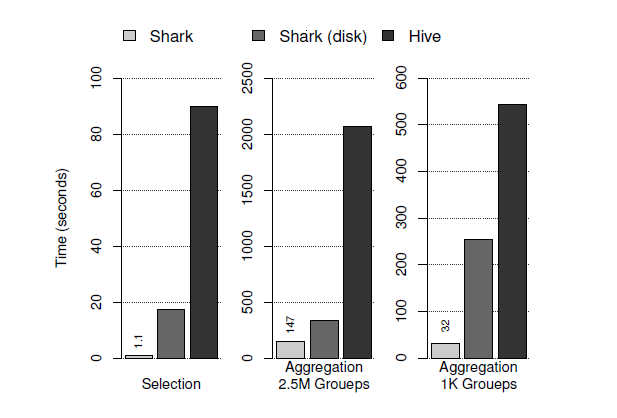
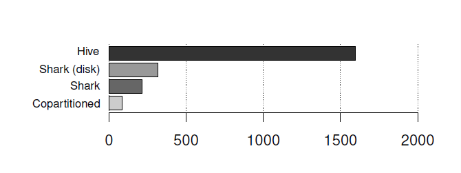
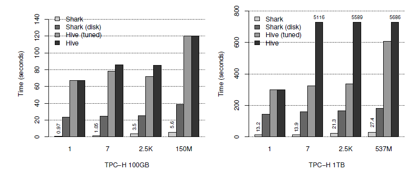
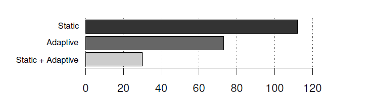
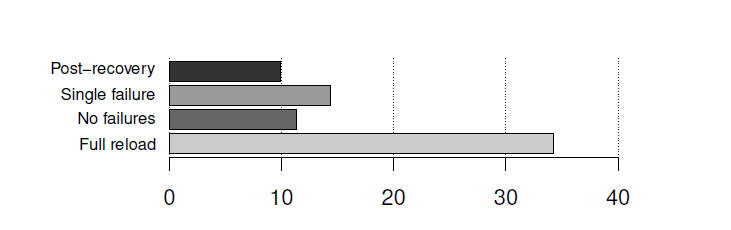
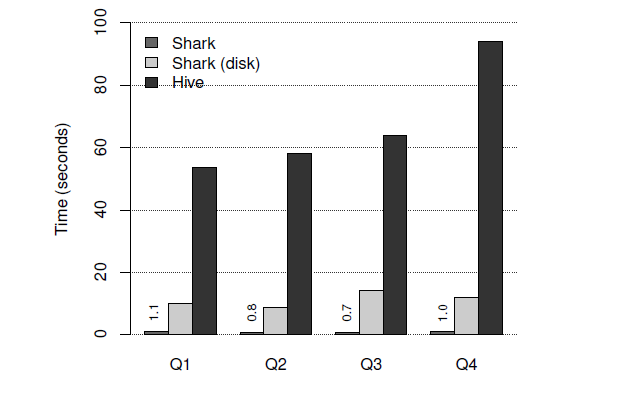

# 3.5 性能

我们使用了四个数据集对 `Shark` 进行了评估：
1. `Pavlo` 等人的基准测试：我们用 2.1`TB` 的数据重现了 `Pavlo` 等人对 `MapReduce` 和分析数据库管理系统的比较【84】。
2. `TPC-H` 数据集:由 `DBGEN` 程序产生了 100`G` 和 1`TB` 的数据集【106】。
3. 真实的 `Hive` 仓库：从一个早期的匿名 `Shark` 用户那里采集了 1.7`TB` 的 `Hive` 仓库数据样本。

总体来说，我们的结果表明，`Shark` 的执行速度要比 `Hive` 和 `Hadoop` 快上 100 倍。特别是，相对于 `Pavlo` 等人的比较报告中`MPP` 数据库的结果，`Shark` 也有可比较的性能提升【84】。对于
那些数据存储在内存中的例子，`Shark`的性能超过了报告中的`MPP` 数据库。

强调一下，我们并不是说，`Shark` 从根本上超越了 `MPP` 数据库的速度；因为 `MPP` 引擎同样可以实现一套与 `Shark` 相同的优化处理方法。事实上，相对于商业引擎来说我们的实现还存在几个缺
点，比如在 `Java` 虚拟机上运行。相反，我们旨在证明的是，当保留一个类似于 `MapReduce` 的引擎并同时留有细粒度的错误恢复特性的情况下，实现可媲美商业引擎的性能也是有可能的。另
外，`Shark` 可以利用这个引擎来在相同的数据上执行复杂的分析（例如, 机器学习），我们相信这将是未来分析工作中必不可少的。

# 3.5.1 方法和集群设置

除非另有说明，否则实验是在 `Amazon EC2` 上使用 100 个` m2.4xlarge` 的节点进行的。每个节点有 8 个虚拟内核，68 `GB` 内存，1.6 `TB` 的本地存储器。

集群运行在 64 位 `Linux` （内核版本为 3.2.28）， 版本0.20.205的`Apache Hadoop` ，和版本 0.9的`Apache Hive` 上。对于 `Hadoop` 的 `MapReduce`，每个节点的 `map` 任务数量以及 `reduce` 的任务数量都匹配节点虚拟内核的数目，
设定为 8。对于 `Hive`，我们对任务之间的 `JVM` 进行重用，并避免合并小的输出文件，这将需要每次查询后执行一个额外的步骤来进行合并。

每个查询我们执行 6 次，第一次的运行结果会被丢弃，并报告余下五次运行的平均值。我们舍弃第一次运行的结果，是为了让 `JVM` 的 `JIT`（`just-in-time`）编译器去优化公共代码路
径。我们认为这更真实的反映了实际的部署，在这样的部署中 `JVM` 将被多个查询重用。

# 3.5.2 `Pavlo` 等人的基准测试

`Pavlo` 等人对 `Hadoop` 与 `MPP` 数据库的性能进行了比较，结果显示 `Hadoop` 在数据导入方面比较擅长，但是在查询的执行【84】方面不是很理想。我们重用了他们基准测试中使用的数据
集和查询语句，来比较 `Hive` 和 `Shark` 的效率。


图 3.1. `Pavlo` 等人的基准测试中选择和聚合的查询时间（秒）


图 3.2 `Pavlo` 基准测试中 `Join` 查询的执行时间（秒）

基准测试使用了两张表：一个是 1`GB`/节点的 `rankings` 表，另一个是 20`GB`/节点的`uservisits` 表。在我们 100 个节点的集群上，我们重建一个 100 `GB` 的 `rankings` 表 ，它包含
18 亿行记录，以及一张包含 155 亿行记录 2 `TB` 的 `uservisits` 表。在试验中我们用 `Hive`以及 `Shark` 分别执行了这四个查询，结果的报告如图 3.1 和 3.2所示。在本小节中，我们手动调整
了 `Hive` 中 `reduce` 任务的数量，以获得对 `Hive` 而言最佳的优化结果。尽管对 `Hive` 做了调整，在所有的例子中`Shark` 的性能还是远远超过了 `Hive`。

选择查询： 第一个查询是在 `rankings` 表上做的一个简单的选择操作：
```scala
SELECT sourceIP, SUM(adRevenue)
FROM uservisits GROUP BY sourceIP;
／ｎ
SELECT SUBSTR(sourceIP, 1,7), SUM(adRevenue) FROM uservisits GROUP BY SUBSTR(sourceIP,1,7);
```
在【84】, 因为针对 `Vertica` 创建了聚集索引，`Vertica` 的性能超过了 `Hadoop` 10 倍。即使没有聚集索引，对于存储在内存上的数据来说，`Shark` 执行这个查询的速度比 `Hive` 快 80 倍以上；如果数
据存储在 `HDFS` 上，`Shark` 也要比 `Hive` 快 5 倍以上。

聚合查询： `Pavlo` 等人的基准测试执行了两个聚合查询。

在我们的数据集中，第一个查询有 200 万个 `Group`，第二个查询大约有一千个 `Group`。`Shark`和 `Hive` 都采用了任务的本地汇聚和数据清洗（`shuffle`），以将最终的归并聚合操作并行
化。`Shark` 的性能再次大幅度的领先于 `Hive`。`MPP` 数据库的基准测试是在每个节点上执行本地聚合，然后将所有的聚合结果发送到一个单一的查询协调器上来做最终的合并;当 `Group`
的数量比较小的时候这种方式表现的非常出色，但有大量 `Group` 的时候执行效果会更差。`MPP`数据库选择计划的方法与 `Shark/Hive` 选择单个 `reduce` 任务的方法类似。

`Join` 查询： `Pavlo` 等人的基准测试的的最后一个查询是把一个 2`TB` 的 `uservisits` 表和一个 100`GB` 的 `rankings` 表 `join` 起来。
```scala
SELECT INTO Temp sourcelP, AVG(pageRank), SUM(adRevenue) as totalRevenue FROM rankings AS R, 
uservisits AS UV WHERE R.pageURL = UV.destURL
AND UV.visitDate BETWEEN Date(’2000-01-15’） AND Date(’2000-01-22’）
GROUP BY UV.sourcelP;
```

`Shark` 的性能再次在所有例子中都超过了 `Hive`。图 3.2 显示了对于该查询，如果提供的内存不足，就不能获得比磁盘更好的性能。这是因为 `Join` 操作的开销在整个查询处理的过程中
占主要地位。但是协同去分区两个表，可以得到比较显的性能提升，因为它避免了在 `join` 步骤中清洗（`shuffle`）2.1 `TB` 的数据的过程。

数据加载: 从【84】 可以看出 `Hadoop` 擅长数据加载，它的数据加载吞吐量是 `MPP` 数据库的5 到 10 倍。就像在第 3.4 节说明的那样，`Shark` 可用于直接查询 `HDFS` 中的数据，这意味着它
的数据导入速率至少和 `Hadoop` 一样快。

生成了 2 `TB` 的 `uservisits` 表后，我们测量并比较了将它加载到 `HDFS` 与加载到 `Shark` 内存中的时间 。我们发现，`Shark` 的内存导入数据的速率要比 `HDFS` 高 5 倍以上。

# 3.5.3 Microbenchmarks

为了了解影响 Shark 性能的因素，我们进行了一系列的的微基准测试。我们使用了 TPC-H
[106]提供的 DBGEN 程序生成了 100 GB 和 1 TB 的数据。我们选择该数据集，是因为它包含了不
同基数的表和列，并且可以用来为测试某个独立的操作创建大量的微基准测试。
在实验中我们发现 Hive 和 Hadoop MapReduce 对于作业设置的 reducer 的数量都是非常敏
感的 Hive 的优化器会基于所估计数据的大小自动设置 reducer 的个数然而，我们发现 hive 的
优化器经常做出错误的判断，导致很长的查询执行时间。我们基于特定查询，并通过试验和错
误的特征对 Hive 手工调整了 reducer 的数量。我们分别给出了通过优化器确定 reducer 数量和
手工调整 reducer 数量的 Hive 性能数据。另一方面，shark 对于 reducer 的数量的敏感程度要
低于 hadoop mapreduce，几乎不需要进行调整。
聚合性能，我们通过在表 TPC-H lineitem 上的运行 group-by 查询来测试聚合性能。对于
100 GB 的数据集，lineitem 表有 6 亿行记录。而对于 1TB 的数据集，则包含 69 亿行记录。


图 3.3。在 lineitem 表上的聚集查询。X 轴表示每次聚合查询 group 的数量

查询语句如下所示：
```scala
SELECT [GROUP 一BY 一COLUMN]，COUNT(*) FROM lineitem
GROUP BY [GROUP 一BY 一COLUMN]
```

我们运行了一个不带 group-by 的聚合查询（例如,一个简单的 count 函数），和三个带
有 group-by 的聚合查询：SHIPMODE（7 组），RECEIPTDATE（2500 组），并 SHIPMODE（1.5 亿
组，100 GB 和 5.37 亿 组，1 TB）。
对于 shark 和 hive 来说，首先在各分区上的进行聚合，聚合的中间结果经过 parition，然
后发送到 reduce task 上，产生最终的聚合结果随着 group（组）的数量变大时，更多的数据
需要通过网络进行 shuffle 操作
图 3.3 对 Shark 和 Hive 的性能进行了对比，并测试了 shark 分别使用内存数据和 HDFS 数
据的性能。从图中可以看出，对于 group 数量较小的查询，shark 比手动调整过的 hive 快 80
倍；对于 group 数量较大的查询，shark 比手动调整过的 hive 快 20 倍。当 group 数量较大时，
整个执行时间主要消耗在 shuffle 阶段。
在某种程度上我们会惊讶于所观察到的 Shark 对磁盘上的数据处理的性能提升。毕竟 shark
和 hive 都要从 hdfs 上读取数据，并为了查询处理要将数据反序列化。对于 shark 和 hive 的这
种差异，可以解释为，shark 的任务启动开销很低，并优化了 shuffle 操作以及其他因素。shark
的执行引擎可以在一秒中内启动数千个任务，以最大化可用的并行度，对于聚合查询它只需要
执行基于 hash 的 shuffle 操作。在 hive 中，hadoop mapreduce 提供的 shuffle 机制只有基于
排序的，这要比基于 hash 的 shuffle 的计算量大。
运行时 Join 选择： 在这个实验中，我们测试了部分 DAG 执行是如何通过对查询计划在运
行时进行重新优化来提升查询性能的。该查询在 1TB TPC-H 数据集中 join 了 lineitem 和 表
supplier 表，并用一个 UDF 对地址进行过滤来选出多感兴趣的供应商。在这种特定的例子下，
UDF 从 1000 万个供应商中选出了 1000 个。图 3.4 总结了这些结果。
```scala
SELECT * from lineitem l join supplier s ON
l.L_SUPPKEY = s.S 一 SUPPKEY WHERE
SOMEUDF(s.SADDRESS)
```
由于在 UDF 中缺乏良好的选择性估算，静态优化器对这两个表做 shuffle join，因为这两
个表的初始化数据很大。通过利用部分 DAG 执行，在对两张表运行预先 shuffle 的 map 阶段后，
Shark 的动态优化其会发现过滤后 supplier 表会变得很小。于是它会决定执行 map-join，将
过滤后的supplier表复制到的所有节点，并在lineitem表上只是用map任务来执行join操作。
为了进一步提高执行效率，优化器会对逻辑计划进行分析，并推断出表 supplier 要比表
lineitem 小的可能行要大得多（因为原先表 supplier 就要小一点，并且对表 supplier 有一个
过滤的谓语）。应此优化器选择只对表 supplier 预先 shuffle，从而避免了在 lineitem 上启动
两波任务。通过结合静态查询分析和部分 DAG 执行，相对于简单的静态选择计划提升了 3 倍的性能。


图 3.4 通过优化器选择 join 策略（秒）

# 3.5.4 Fault Tolerance

为了测试节点故障情况下 Shark 的性能，我们模拟故障并在故障恢复之前、期间、之后进
行了查询性能的测试。图 3.5 总结了 5 个错误恢复的实验，这些实验运行在 EC2 集群上，是
能够用了 50 个 m2.4xlarge 节点。
在出现节点错误的情况下，我们对 100GB lineitem 表使用 group by 查询来测测试查询性
能。在将 lineitem 的数据加载到 shark 的内存存储后，我们切断了一台工作的机器并重新运
行查询。Shark 能完美地从故障中恢复，并以并行的方式在其他 49 个节点上重新构建丢失的数
据分块。这个恢复过程对性能有小许的影响，但比重新加载整个数据集并重新进行查询的成本
要低很多 (14 vs 34 secs)。
恢复之后，后续查询操作继续使用已经恢复的数据集，尽管只有较少的机器。在图 3.5 中，
恢复后的性能要比故障前的性能要好；我们认为，这是 JVM 的 JIT 编译器的副作用，因为在恢
复后的查询运行的时候，越来越多的调度程序代码可能已经编译好了，这只是推论。

# 3.5.5 Real HiveWarehouse Queries

真实的 Hive 数据仓库查询
一个早期的工业用户（匿名）为我们提供了他们自己的 Hive 数据仓库和两年的 Hive 查询
痕迹的一个样本。该用户是一个行业领先的视频分析公司，作为内容的提供商和发布商，他们
大部分的分析栈是基于 Hadoop 的。我们拿到了 30 天视频会议数据的样本，解压后占 1.7 TB
的磁盘空间。该样本有一个 103 列的表，并大量使用复杂的数据类型，如数组和结构体。采样
的查询日志中包含 3833 个分析查询，排序的频率。我们筛选出了那些调用私有的 UDF 的查询并
从整个查询痕迹中选出了 4 个典型的被频繁使用的查询。这些查询基于不同的分片计算出总的
视频质量指标。


图 3.5 故障的查询时间（秒)


图 3.6 真实的 Hive 数据仓库的工作

1.查询 1 计算某一天特定客户用户的 12 维度汇总统计。
2.查询 2 给出对 8 个列使用谓语过滤并以国家进行分组所得出的不重复的“消费者/客户
“组合和会话的个数。
3.查询 3 给出除了 2 个国家外的所有国家的会话个数和不重复的用户
4.查询 4 对一个列进行分组，计算出在 7 个维度上的汇总数据并以降序的方式显示那些最
顶层的组。
图 3.6 比较 Shark 和 Hive 在这些查询上的性能。 由于 Shark 能够在亚秒级的时间里处理
这些现实生活中的所有查询（除了其中一条），而 Hive 要使用 50 被甚至上百倍的时间来处
理，这样的结果说明 Shark 很有前景。
这些查询表明，该数据显示出在 3.4.3 节中提到的自然聚类性质。 Map 修剪技术平均减少
了 30 倍的数据扫描量。


