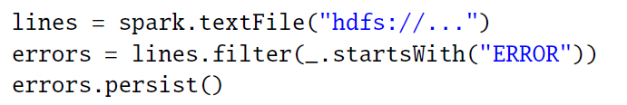
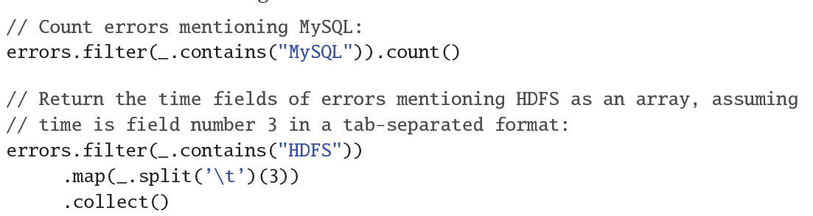

# 2.2　`RDD`抽象

本节概述了一下`RDDs`。我们首先定义`RDDs`（`x2.2.1`），并且介绍下它们的在`Spark`（`x2.2.2`）上的编程接口。然后我们把`RDDs`
和细粒度共享内存抽象比较一下(`x2.2.3`)。最终，我们讨论了`RDD`模型的局限之处(`x2.2.4`)。

# 2.2.1　定义
形式上看，`RDD`是一个只读的、分区的记录集。`RDDs`只能通过对稳定存储的数据或者其他`RDDs`的确定性操作来创建。我们把这些操作称为转换，可以把它们和其他
`RDDs`的操作区分开来的。转换的例子有`map`、过滤和连接。

`RDDs`不需要总是被物化。相反，一个`RDD`拥有足够的关于其如何从其他数据集衍生（血统）而可以从稳定存储的数据计算它的分区。这是一个强大的特性，本质上，
一个程序不能参照一个并不能在失败后重建的`RDD`。

最后，用户可以控制`RDDs`的其他的两个方面：`persistence`和分区。用户可以表明他们将要重用哪一个`RDDs`并且为它们选择一个存储策略（例如，内存存储）。
他们也可以要求一个`RDD`的元素是基于每条记录的一个键值跨机器分区的。这对位置优化是有用处的，比如说可以确保两个将被连接起来的数据集是以同样方式进行哈希分区的。

# 2.2.2　`Spark`编程接口
`Spark`通过一个类似于`ryadLINQ`【115】和`FlumeJava`【25】的集成语言`API`开放了`RDDs`，其中每个数据集由一个对象代表，而转换可以由这些对象上的方法调用。

程序员首先通过稳定存储的数据的转换（例如`map`和过滤）定义一个或者多个`RDDs`，然后他们可以使用`RDDs`的动作类`actions`，这是可以向应用程序返回一个值或者把数据导出到一个存储
系统的操作。动作类`actions`的例子有计数`count`（返回数据集中元素的数目），`collect`（返回数据元素本身）和`save`（把数据集输出到存储系统）。像`DryadLINQ`那样，`Spark`
直到第一次调用`RDDs`的动作时，才开始计算`RDDs`，使得`Spark`可以按序缓存多个变换。

此外，程序员可以调用一种`persist`方法，来表明他们在未来的操作中想重用这一种`RDDs`。`Spark`默认在内存中保存了持久的`RDDs`，但是如果内存不足，它也可以把`RDDs`写入硬盘中。
用户也可以请求其他的持久性策略，通过标记来进行持久化`persist`，比如说把`RDD`只存储在硬盘上或者跨机器去进行复制。最后，用户可以在每个`RDD`上设置一个持久化优先级，来指定
某个内存数据可以优先写入磁盘中。

 **例子：控制台日志挖掘**　
假设一个`web`服务遇到错误，而操作员想要在`Hadoop`文件系统（`HDFS`【11】）中搜索万亿字节的日志来找到原因。借助`Spark`，操作员可以跨一组节点就把错误信息从日志中加载到内存中，
且交互地进行查询。可以先键入以下的`Scala`代码：
 

第一行定义了由一个`HDFS`文件（作为一个行文本集）返回的`RDD`，而第二行则由它衍生了一个过滤的`RDD`。然后第三行要求错误持久存储在内存中，从而可以在查询之间共享。
请注意，过滤的参数是一个`Scala`闭包的语法。

到此，集群还没有执行工作。然而，用户可以使用`RDD`的动作了，比如去计算信息的数量：
errors.count()

图2.1示例中第 3 个查询的`lineage`示意图，方块代表`RDDs`，箭头表示的转换。

用户也可以在`RDD`执行进一步的转换，并使用他们的结果，如下面几行：

