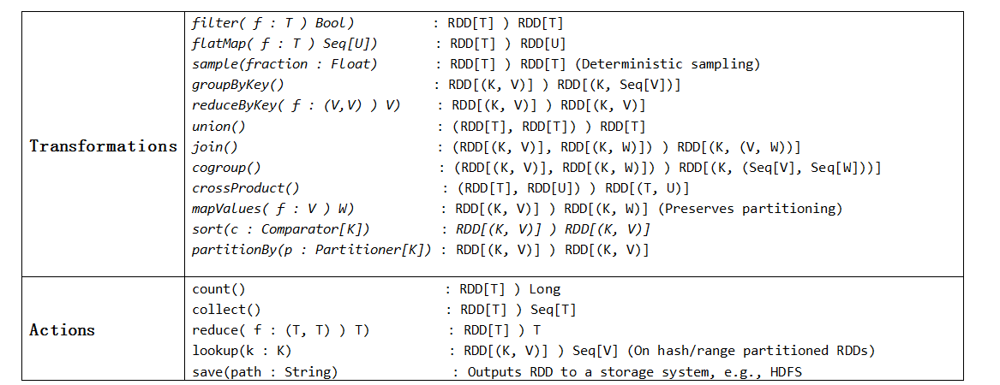
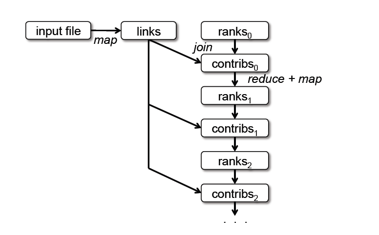
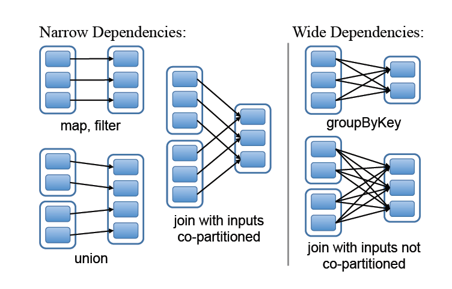
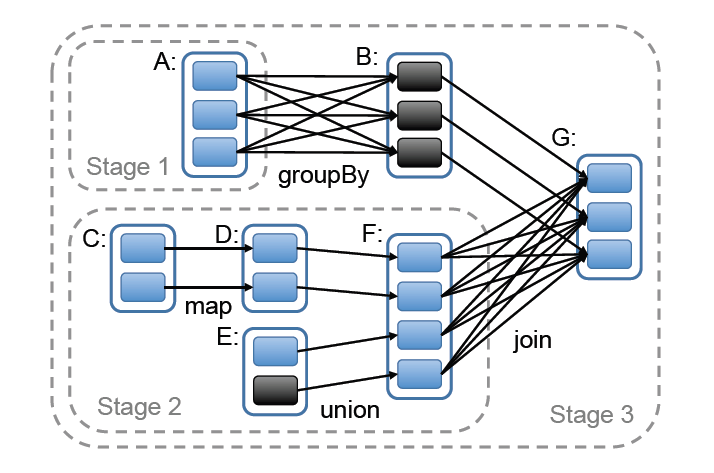

# 2.2　`RDD`抽象

本节概述了一下`RDDs`。我们首先定义`RDDs`（`x2.2.1`），并且介绍下它们的在`Spark`（`x2.2.2`）上的编程接口。然后我们把`RDDs`
和细粒度共享内存抽象比较一下(`x2.2.3`)。最终，我们讨论了`RDD`模型的局限之处(`x2.2.4`)。

# 2.2.1　定义
形式上看，`RDD`是一个只读的、分区的记录集。`RDDs`只能通过对稳定存储的数据或者其他`RDDs`的确定性操作来创建。我们把这些操作称为转换，可以把它们和其他
`RDDs`的操作区分开来的。转换的例子有`map`、过滤和连接。

`RDDs`不需要总是被物化。相反，一个`RDD`拥有足够的关于其如何从其他数据集衍生（血统）而可以从稳定存储的数据计算它的分区。这是一个强大的特性，本质上，
一个程序不能参照一个并不能在失败后重建的`RDD`。

最后，用户可以控制`RDDs`的其他的两个方面：`persistence`和分区。用户可以表明他们将要重用哪一个`RDDs`并且为它们选择一个存储策略（例如，内存存储）。
他们也可以要求一个`RDD`的元素是基于每条记录的一个键值跨机器分区的。这对位置优化是有用处的，比如说可以确保两个将被连接起来的数据集是以同样方式进行哈希分区的。

# 2.2.2　`Spark`编程接口
`Spark`通过一个类似于`ryadLINQ`【115】和`FlumeJava`【25】的集成语言`API`开放了`RDDs`，其中每个数据集由一个对象代表，而转换可以由这些对象上的方法调用。

程序员首先通过稳定存储的数据的转换（例如`map`和过滤）定义一个或者多个`RDDs`，然后他们可以使用`RDDs`的动作类`actions`，这是可以向应用程序返回一个值或者把数据导出到一个存储
系统的操作。动作类`actions`的例子有计数`count`（返回数据集中元素的数目），`collect`（返回数据元素本身）和`save`（把数据集输出到存储系统）。像`DryadLINQ`那样，`Spark`
直到第一次调用`RDDs`的动作时，才开始计算`RDDs`，使得`Spark`可以按序缓存多个变换。

此外，程序员可以调用一种`persist`方法，来表明他们在未来的操作中想重用这一种`RDDs`。`Spark`默认在内存中保存了持久的`RDDs`，但是如果内存不足，它也可以把`RDDs`写入硬盘中。
用户也可以请求其他的持久性策略，通过标记来进行持久化`persist`，比如说把`RDD`只存储在硬盘上或者跨机器去进行复制。最后，用户可以在每个`RDD`上设置一个持久化优先级，来指定
某个内存数据可以优先写入磁盘中。

 **例子：控制台日志挖掘**　
假设一个`web`服务遇到错误，而操作员想要在`Hadoop`文件系统（`HDFS`【11】）中搜索万亿字节的日志来找到原因。借助`Spark`，操作员可以跨一组节点就把错误信息从日志中加载到内存中，
且交互地进行查询。可以先键入以下的`Scala`代码：
 
```scala
lines = spark.textFile("hdfs://...")
errors = lines.filter(_.startsWith("ERROR"))
errors.persist()
```

第一行定义了由一个`HDFS`文件（作为一个行文本集）返回的`RDD`，而第二行则由它衍生了一个过滤的`RDD`。然后第三行要求错误持久存储在内存中，从而可以在查询之间共享。
请注意，过滤的参数是一个`Scala`闭包的语法。

到此，集群还没有执行工作。然而，用户可以使用`RDD`的动作了，比如去计算信息的数量：
`errors.count()`


图2.1示例中第 3 个查询的`lineage`示意图，方块代表`RDDs`，箭头表示的转换。

用户也可以在`RDD`执行进一步的转换，并使用他们的结果，如下面几行：

```scala
// Count errors mentioning MySQL:
errors.filter(_.contains("MySQL")).count()
// Return the time fields of errors mentioning HDFS as an array, assuming
// time is field number 3 in a tab-separated format:
errors.filter(_.contains("HDFS"))
.map(_.split('\t')(3))
.collect()
```

在第一个涉及错误的动作运行之后，`Spark`会把出错的分区存储在内存中，这会大大的加快它的后续操作。请注意基层的`RDD`、行并没有加载到内存中。
这是可取的，因为错误信息可能只是数据的一小部分（足够小，所以适合内存存储）。

最后，为了说明我们的模型是怎么实现容错的，我们展示了图2.1中第三个查询的`RDDs`血统图。在这个查询中，我们从错误开始，得出其所对应的`RDD`行，接着对行
进行过滤操作，之后再次进行过滤、`Map` 操作，最后进行`collect`。　`Spark`调度器将会对最后的两个转换操作进行排队，并且发送一组计算任务给那些保存了错误的缓存分区节点。
此外，如果一个错误分区丢失，`Spark`可以通过在相应的分区行上应用一个过滤器去重新构建它。

# 2.2.3　`RDD`模型的优点

|方面|`RDDs`|分布式共享内存|
|---|:---|:---:|
|读|粗粒度或细粒度|细粒度|
|写|粗粒度|细粒度|
|一致性|不值一提的（稳定的）|取决于`app`和运行时|
|故障恢复|基于血统的细粒度和低开销|需要检查点和程序回滚|
|慢任务缓解|可能使用备份任务|困难|
|工作布置|基于数据位置的自动化|取决于`app`（运行时要清楚）|
|内存不足时的表现|类似于现有的数据流系统|性能差（`swapping?`）|
表2.1．　`RDDs`和分布式共享内存之间的比较

为了理解`RDDs`作为一个分布式内存抽象的优点，我们在表2.1中把它和分布式共享内存（`DSM`）作了一下比较。在`DSM`系统中，应用程序在一个全球的地址空间可以向任意的位置写和读。
注意在这个定义下，我们不仅包括传统的共享内存系统【79】，而且也有那些应用程序细粒度写入共享状态的其他系统，如`Piccolo`【86】，提供了一个共享的`DHT`和分布式数据库。
`DSM`是一个非常通用的抽象，但是这个通用性使它在商业集群上实现高效和容错变得比较困难。

`RDDs`和`DSM`之间的主要区别是`RDDs`只能够通过粗粒度转换来创建（“写”），然而`DSM`却可以向每个内存位置读和写。这限制了`RDDs`向应用程序的批量写入操作，却具有更高效的容错。
特别是，`RDDs`不需要应付检查点的开销，因为它们可以使用血统图而恢复。此外，只有`RDD`的丢失分区需要重新计算，而且它们可以在不同的节点上并行地重新计算，并不需要回滚整个程序。

`RDDs`的第二个优点是它们不变的性质，可以通过运行`MapReduce`【36】的慢任务备份副本来缓解慢节点（`stragglers`）。备份任务在`DSM`中实现将会很困难，因为一个任务的两个副本将会访问同一
个内存位置，而干扰了彼此的更新。

最后，`RDDs`比`DSM`多了其他两个优点。首先，在`RDDs`的批操作中，一个运行时能够基于数据位置来调度任务，从而提高性能。第二，`RDDs`能够平稳的降级当没有足够的内存来存储时，只要它们
仅仅是被用于基于扫描的操作。并不适合内存的分区可以存储在磁盘上，并将提供类似于当前并行式数据系统的性能。


图2.2　`Spark`运行时．　用户的驱动程序启动了多个工作进程，从分布式文件系统里面读取数据块，并且在内存中`persist``RDD`的计算分区。

# 2.2.4　不适用于`RDDs`的应用程序

正如介绍中所讨论，`RDDs`最适合在同一个数据集的所有元素上执行相同的操作的那些批处理应用程序。在这些情况下，`RDDs`可以高效的记住每一个转换操作，作为血统图中的一个步骤，从而可以不需要记录大量的数据就
恢复了丢失的分区。`RDDs`不太适用那些对共享状态进行异步细粒度更新的应用程序，比如一个`web`应用程序的存储系统和一个增量的`web`爬虫。对于这些应用程序，使用那些可以执行传统的更新记录和数据检查点的系统将会更
高效，比如数据库，`RAMCloud` 【81】，`Percolator` 【85】和`Piccolo` 【86】。我们的目标是给批量分析提供一个高效的编程模型，并把这些异步应用程序留给专业系统来解决。尽管如此，第五章涵盖了一些可能的方法，使用
`RDD`模型来整合这些类型的应用程序，例如批量更新。

# 2.3　`Spark`编程接口

`Spark`通过类似于`Scala`【92】（一种基于`Java` 虚拟机的静态类型函数式的编程语言）中的`DryadLINQ`【115】的一个集成语言`API`提供了`RDD`抽象。我们选择`Scala`是由于它的简洁（方便互动使用）和效率（由于静态输入）的结合。
然而却没有任何关于`RDD`的抽象，需要一个函数式的语言。

为了使用`Spark`，开发人员们写了一个把一个集群的工作进程连接起来的驱动程序，如图2.2所示那样。该驱动定义了一个或多个`RDDs`，并且调用它们的动作类。磁盘上的`Spark`代码也记录了`RDDs`的血统图。
这些工作进程是可以把一连串操作的`RDD`分区存入在内存中的长期活跃的进程。

正如我们在 2.2.2 节的日志挖掘例子中所看到的，用户通过传递闭包（函数字面量）的方式将参数传递给`map`等`RDD`操作。在`Scala`中每个闭包都代表一个`Java`对象，这些对象可以被序列化，也可以加载在其他节点
并跨网络传递闭包。`Scala`会将闭包中的所有变量保存为`Java`对象的属性域。例如，我们可以写类似`var x = 5; rdd.map(_ + x)` 的代码来将 5 加到`RDD`的每个元素上。

`RDDs` 是一个通过元素类型而参数化的静态类型对象。例如`RDD[Int]`是一个整数型`RDD`。然而，我们大多数的例子中都忽略类型是因为`Scala`的类型推断。

尽管我们在`Scala`中暴露`RDDs`的方法很简单，我们却必须用反射【118】来解决`Scala` 的闭包对象问题。为了使`Spark`在`Scala`的解释器中可用，我们还需要做更多的工作，我们将在 2.5.3.节来讨论。
然而，我们没必要修改`Scala`编译器。


表 2.2`Spark` 中`RDD`的一些可用的`transform`操作和`action`  操作。`Seq[T]` 表示 `T` 类型的元素序列。

# 2.3.1　`Spark`中的`RDD`操作

表 2.2 列出了`Spark` 中`RDD`的一些主要`transform`操作和`action` 操作。我们给出了每个操作签名，方括号中显示了类型参数。我们可以将`transformations` 理解成一种惰
性操作，它只定义了一个新的`RDD`，而不立即计算它。相反，`actions` 则是启动计算返回结果给程序或者将结果写入到外部存储中。

请注意某些操作，例如`join` 只适合键值对类型的`RDDs`。此外，我们函数名的选择符合`Scala`的其他`API`和其他函数式语言的规范。例如`map` 表示一对一的映射，而`flatMap` 则表示每个输入对应一个或者多个输出的映射
（类似于`MapReduce` 中的`map`）。

除了这些操作，用户还可以请求持久化(`persist`)一个`RDD`。此外，用户可以得到一个`RDD`的分区号，它由一个`Partitioner`类表示，并且根据它划分另一个数据集。一些操作例如`groupByKey`,
`reduceByKey` 以及`sort`会自动产生一个基于哈希或者范围分区的`RDD`。

# 2.3.2　应用示例

我们用两个迭代型应用的例子来补充了一下2.2.2 节的数据挖掘示例：`logistic　regression`(逻辑回归)和 `PageRank`。后者还展示了如何控制`RDDs`的分区来提升性能。

# `Logistic Regression`(逻辑回归)

很多机器学习算法本质上是迭代型的，因为它们要运行迭代式的优化算法，比如采用梯度下降法最大化目标函数。因此，通过将数据缓存在在内存中可以加速它们运行。

作为一个例子，下面的程序实现了`logistic　regression`【53】，它是一种常见的分类算法：目的是找到一个超平面`w`，以最好地将两个点集合分开 (比如, 垃圾邮件和非垃圾邮件）。
该算法使用梯度下降法：首先对`w`取一个随机值，在每一步迭代时计算`w` 函数在数据集上的和，然后沿着梯度方向移动`w`来改进它。

```scala
val points = spark.textFile(...).map(parsePoint).persist()
var w = // random initial vector
for (i <- 1 to ITERATIONS) {
　val gradient = points.map { p =>
　　p.x * (1 / (1 + exp(-p.y * (w dot p.x))) - 1) * p.y
　}.reduce((a,b) => a + b)
　w -= gradient
}
```

首先，我们定义了一个持久化的`RDD`称之为 `points` ，它是通过对文本文件做`map` 转换（对每一行文本解析得到一个`Point` 对象）得到的结果。然后我们在每一步都重复的
对`points`执行`map` 操作和`reduce` 操作来计算梯度，梯度是对当前`w` 的函数求和得到。如 2.6.1.节所述，在每一步迭代中将`points`缓存在内存中能够获得 20 多倍的速度提升。

# `PageRank`
在`PageRank`【21】中有一个比较复杂的数据共享模式。该算法通过对链接到该文档的其它文档的贡献值求和而迭代地对每个文档更新`rank`值。在每次迭代中，每个文档发送一个贡献值
`r/n`到其邻近结点，其中`r`表示它的的`rank` ，`n` 为其相邻节点数。然后文档更新其`rank` 值为：`α/N + (1 —α) Σci`,这里的求和是对接收到的所有贡献值求和，
`N `表示总的文档数，`a`是一个调优参数。我们用`Spark` 实现的`PageRank`的代码如下：

```scala
// Load graph as an RDD of (URL, outlinks) pairs
val links = spark.textFile(...).map(...).persist()
var ranks = // RDD of (URL, rank) pairs
for (i <- 1 to ITERATIONS) {
　　// Build an RDD of (targetURL, float) pairs with contributions sent by each page
　　val contribs = links.join(ranks).flatMap {
　　　case (url, (links, rank)) =>
　　　　links.map(dest => (dest, rank/links.size))
　　}
　　// Sum contributions by URL and get new ranks
　　ranks = contribs.reduceByKey((x,y) => x+y).mapValues(sum => a/N + (1-a)*sum)
}
```


图2.3　`PageRank`中数据集的`Lineage`图

该程序生成的`RDD lineage`如上图 2.3 所示。在每一步迭代中，我们基于`contribs`和上一步迭代的`ranks`，以及静态的`links`数据集建立了一个新的`ranks`数据集。
本图的一个有趣特点是它会随着迭代次数而变长。因此，在一个有多次迭代的作业中，可能需要去可靠地复制 `ranks` 的某些版本以来缩短故障恢复的时间【66】。
用户能够调用一个`RELIABLE`标识的`persist`接口来做到这点。然而，需要注意`links`数据集不需要复制，因为它的分区可以通过对输入文件块的重新执行`map`操作来
重建。`links`数据集通常比`ranks`大很多，因为每个文档有很多链接，但是只有一个数值作为它的`rank`，因此使用`lineage`来恢复它会比对程序的内存状态做`checkpoint`的
那些系统更节省时间。

最后，通过控制`RDD`的分区策略，我们能够优化`PageRank` 的通信。如果我们指定了`links`的一种分区策略（比如，通过所有节点上的`URL`对`link`列表进行`hash` 分区），
我们可以对`ranks`用同样的方式分区，保证`links`和`ranks` 之间的`join` 操作不需要通信（因为每个`URL`的`link`和`rank` 列表将在同一机器上）。我们也能够写一个自定义的
 `Partitioner` 类将相互链接的页面分在一组(比如，根据域名对`URL`进行分区)。这两种优化都能在我们定义`links`时调用`partitionBy` 来实现：
 
```scala
 links = spark.textFile(...).map(...)
 　　　.partitionBy(myPartFunc).persist()
```

在这个初始调用之后，`links`和`ranks` 的`join` 操作将自动将每个`URL`的贡献值聚合到`link` 列所在的机器上，计算新的`rank`值并和它的`links`做`join` 操作。
这种迭代间的一致性分区策略是一些特定框架的主要优化方法，例如`Pregel` 。`RDDs` 允许用户直接实现这个目标。

|操作|含义|
|---|:---|
|partitions()|返回分区对象列表|
|preferredLocations(p)|根据数据的本地特性，列出 能够快速访问分区 p的节点。|
|dependencies() |返回依赖列表|
|iterator(p, parentlters) | 给定 p 的父分区的迭代，计算分区 p 的元素|
|partitioner()|返回能够说明 RDD 是hash 或 range 分区的元数据|
表 2.3 　`Spark`中用于表示`RDDs` 的接口

# 2.4　`RDDs`表现形式

把`RDDs`作为抽象使用而面临的挑战之一是如何去选取一个可以在大量的`transform`之间追踪到其血统图的表现形式。理想情况下，
一个实施了`RDDs`的系统应该尽可能丰富地提供各种变换操作（如表 2.2 中那些），并可以允许用户随意地进行组合。我们提出了一种基于图形的`RDDs`表现形式，可以
实现上述目标。我们已经在`Spark`中使用它来提供各种`transform`操作，而无需为每个`transform`的调度增加特殊的逻辑。这极大地简化了系统的设计。

简而言之，我们通过一个可以提供5种信息的通用接口来表现每个`RDD`：一组分区，数据集的原子集合；一组指向父`RDDs`的依赖关系；一个基于父`RDD`的数据集的计算函数；
和关于分区策略和数据布置的元数据。例如，表现一个`HDFS`文件的`RDD`一个对每个文件块的分区，并且知道每个文件块在哪台机器。同时，在这个`RDD`上的一个`map`任务的
结果具有相同的分区，当计算其元素时，将`map`函数应用于父`RDD`的数据。我们在表 2.3 中对这个接口做了总结。

在设计这个接口时，最有趣的问题是怎么表现`RDDs`之间的依赖关系。我们发现把依赖关系分成两种类型是合理而且有用的：窄依赖：每个父`RDD`的分区都至多被一个子`RDD`的分区使
用；宽依赖：多个子`RDD`的分区依赖同一个父`RDD`的分区。例如，`map`操作是一种窄依赖，而`join` 操作是一种宽依赖（除非父`RDD`已经基于 Hash 策略被分区过了）。
图 2.4 中展示了一些其他例子。

这种区别从两个方面来说是有用的。首先，窄依赖允许在单个集群节点上流水线式执行，这个节点可以计算所有父分区。例如，可以逐个元素依次地执行`filter` 和`map` 操作。
相比之下，宽依赖需要所有的父`RDD`数据是可用的，并且数据已经通过类`MapReduce` 的操作进行`shuffle`。其次，在窄依赖中，节点失败后的恢复更加高效。因为只有丢失的父分区需
要重新计算，并且它们可以并行地在不同节点上重新计算。而在宽依赖的血统图中，单个失败的节点可能导致一个`RDD`的所有先祖`RDD`中的一些分区丢失，导致全部计算需要重新执行。

这种`RDDs`的通用接口使得在`Spark` 中用不到 20 行的代码来实现了大多数的`transform`操作。事实上，即使是`Spark` 的新用户也能实现新的`transform`操作（如：抽样和各种类型的`join`）
而不必了解调度的细节。下面是一些`RDD`实现的概略图。

# `HDFS`文件：
在我们的例子中，输入`RDD`是`HDFS`文件。对于这些`RDD`，`partitions` 返回文件中每个文件块的分区（包含文件块在每个分区对象中的偏移量），`preferredLocations` 提供文件块所在的节点，
而`iterator` 读取这些文件块。

# `map`：
在任何一个`RDD`上调用`map` 操作将返回一个`MappedRDD` 对象。这个对象与其父对象具有相同的分区以及首选地点（`preferredLocations`），但在其迭代方法（`iterator` ）中，
把传递给`map`的函数应用到父对象记录。

# `union`：
在两个`RDD`上调用`union`操作将返回一个`RDD`，它的分区为它们的父`RDD`的分区`union`的结果。每个子分区都是通过在一个父分区上的窄依赖计算出来的。

# `sample`：
抽样类似于映射。不同之处是`RDD`会为每一个分区存储一个生成随机数的种子来对确定如何对父记录进行抽样。

# `join`：
连接两个`RDD`可能会产生两个窄依赖和两个宽依赖（如果两个`RDD`都是基于相同的`Hash`/范围分区策略），或一个混合（如果一个父`RDD`具有某种划分策略而另一个不具有）。
无论哪种情况，输出`RDD`都具有一个分区策略（要么继承于父`RDD`，要么是一个默认的`Hash`分区策略）。

# 2.5　实现

# 2.5.1　任务调度

我们用大概34000行的`Scala`语言实现了`Spark`。系统运行在各种各样的集群`managers`（包括`Apache Mesos`【56】，`Hadoop YARN`【109】和`Amazon EC2`【4】）上，和它自己的内置集群`manager`。
每个`Spark`程序在集群上有着自己的驱动（`master`）和工作进程，作为一个独立的应用程序运行，并且这些应用程序间的资源共享是由集群`manager`处理的。

`Spark`能够借助`Hadoop`现有的输入插件`APIs`从任何一个`Hadoop`输入源（例如，`HDFS`或者`HBase`）读取数据，并且在`Scala`的一个未修改版本上运行。




# 2.5.２　多租户




