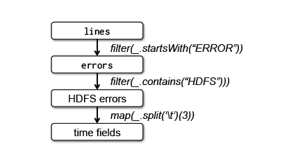
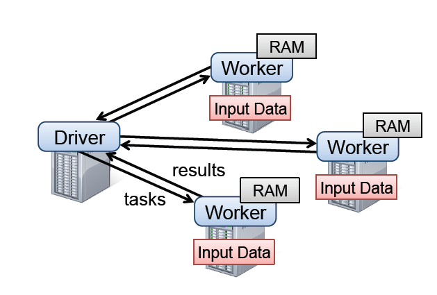

# 2.2　`RDD`抽象

本节概述了一下`RDDs`。我们首先定义`RDDs`（`x2.2.1`），并且介绍下它们的在`Spark`（`x2.2.2`）上的编程接口。然后我们把`RDDs`
和细粒度共享内存抽象比较一下(`x2.2.3`)。最终，我们讨论了`RDD`模型的局限之处(`x2.2.4`)。

# 2.2.1　定义
形式上看，`RDD`是一个只读的、分区的记录集。`RDDs`只能通过对稳定存储的数据或者其他`RDDs`的确定性操作来创建。我们把这些操作称为转换，可以把它们和其他
`RDDs`的操作区分开来的。转换的例子有`map`、过滤和连接。

`RDDs`不需要总是被物化。相反，一个`RDD`拥有足够的关于其如何从其他数据集衍生（血统）而可以从稳定存储的数据计算它的分区。这是一个强大的特性，本质上，
一个程序不能参照一个并不能在失败后重建的`RDD`。

最后，用户可以控制`RDDs`的其他的两个方面：`persistence`和分区。用户可以表明他们将要重用哪一个`RDDs`并且为它们选择一个存储策略（例如，内存存储）。
他们也可以要求一个`RDD`的元素是基于每条记录的一个键值跨机器分区的。这对位置优化是有用处的，比如说可以确保两个将被连接起来的数据集是以同样方式进行哈希分区的。

# 2.2.2　`Spark`编程接口
`Spark`通过一个类似于`ryadLINQ`【115】和`FlumeJava`【25】的集成语言`API`开放了`RDDs`，其中每个数据集由一个对象代表，而转换可以由这些对象上的方法调用。

程序员首先通过稳定存储的数据的转换（例如`map`和过滤）定义一个或者多个`RDDs`，然后他们可以使用`RDDs`的动作类`actions`，这是可以向应用程序返回一个值或者把数据导出到一个存储
系统的操作。动作类`actions`的例子有计数`count`（返回数据集中元素的数目），`collect`（返回数据元素本身）和`save`（把数据集输出到存储系统）。像`DryadLINQ`那样，`Spark`
直到第一次调用`RDDs`的动作时，才开始计算`RDDs`，使得`Spark`可以按序缓存多个变换。

此外，程序员可以调用一种`persist`方法，来表明他们在未来的操作中想重用这一种`RDDs`。`Spark`默认在内存中保存了持久的`RDDs`，但是如果内存不足，它也可以把`RDDs`写入硬盘中。
用户也可以请求其他的持久性策略，通过标记来进行持久化`persist`，比如说把`RDD`只存储在硬盘上或者跨机器去进行复制。最后，用户可以在每个`RDD`上设置一个持久化优先级，来指定
某个内存数据可以优先写入磁盘中。

 **例子：控制台日志挖掘**　
假设一个`web`服务遇到错误，而操作员想要在`Hadoop`文件系统（`HDFS`【11】）中搜索万亿字节的日志来找到原因。借助`Spark`，操作员可以跨一组节点就把错误信息从日志中加载到内存中，
且交互地进行查询。可以先键入以下的`Scala`代码：
 
```scala
lines = spark.textFile("hdfs://...")
errors = lines.filter(_.startsWith("ERROR"))
errors.persist()
```

第一行定义了由一个`HDFS`文件（作为一个行文本集）返回的`RDD`，而第二行则由它衍生了一个过滤的`RDD`。然后第三行要求错误持久存储在内存中，从而可以在查询之间共享。
请注意，过滤的参数是一个`Scala`闭包的语法。

到此，集群还没有执行工作。然而，用户可以使用`RDD`的动作了，比如去计算信息的数量：
`errors.count()`



图2.1示例中第 3 个查询的`lineage`示意图，方块代表`RDDs`，箭头表示的转换。

用户也可以在`RDD`执行进一步的转换，并使用他们的结果，如下面几行：

```scala
// Count errors mentioning MySQL:
errors.filter(_.contains("MySQL")).count()
// Return the time fields of errors mentioning HDFS as an array, assuming
// time is field number 3 in a tab-separated format:
errors.filter(_.contains("HDFS"))
.map(_.split('\t')(3))
.collect()
```

在第一个涉及错误的动作运行之后，`Spark`会把出错的分区存储在内存中，这会大大的加快它的后续操作。请注意基层的`RDD`、行并没有加载到内存中。
这是可取的，因为错误信息可能只是数据的一小部分（足够小，所以适合内存存储）。

最后，为了说明我们的模型是怎么实现容错的，我们展示了图2.1中第三个查询的`RDDs`血统图。在这个查询中，我们从错误开始，得出其所对应的`RDD`行，接着对行
进行过滤操作，之后再次进行过滤、`Map` 操作，最后进行`collect`。`Spark`调度器将会对最后的两个转换操作进行排队，并且发送一组计算任务给那些保存了错误的缓存分区节点。
此外，如果一个错误分区丢失，`Spark`可以通过在相应的分区行上应用一个过滤器去重新构建它。

# 2.2.3　`RDD`模型的优点

|方面|`RDDs`|分布式共享内存|
|---|:---|:---:|
|读|粗粒度或细粒度|细粒度|
|写|粗粒度|细粒度|
|一致性|不值一提的（稳定的）|取决于`app`和运行时|
|故障恢复|基于血统的细粒度和低开销|需要检查点和程序回滚|
|慢任务缓解|可能使用备份任务|困难|
|工作布置|基于数据位置的自动化|取决于`app`（运行时要清楚）|
|内存不足时的表现|类似于现有的数据流系统|性能差（`swapping?`）|
表2.1．　`RDDs`和分布式共享内存之间的比较

为了理解`RDDs`作为一个分布式内存抽象的优点，我们在表2.1中把它和分布式共享内存（`DSM`）作了一下比较。在`DSM`系统中，应用程序在一个全球的地址空间可以向任意的位置写和读。
注意在这个定义下，我们不仅包括传统的共享内存系统【79】，而且也有那些应用程序细粒度写入共享状态的其他系统，如`Piccolo`【86】，提供了一个共享的`DHT`和分布式数据库。
`DSM`是一个非常通用的抽象，但是这个通用性使它在商业集群上实现高效和容错变得比较困难。

`RDDs`和`DSM`之间的主要区别是`RDDs`只能够通过粗粒度转换来创建（“写”），然而`DSM`却可以向每个内存位置读和写。这限制了`RDDs`向应用程序的批量写入操作，却具有更高效的容错。
特别是，`RDDs`不需要应付检查点的开销，因为它们可以使用血统图而恢复。此外，只有`RDD`的丢失分区需要重新计算，而且它们可以在不同的节点上并行地重新计算，并不需要回滚整个程序。

`RDDs`的第二个优点是它们不变的性质，可以通过运行`MapReduce`【36】的慢任务备份副本来缓解慢节点（`stragglers`）。备份任务在`DSM`中实现将会很困难，因为一个任务的两个副本将会访问同一
个内存位置，而干扰了彼此的更新。

最后，`RDDs`比`DSM`多了其他两个优点。首先，在`RDDs`的批操作中，一个运行时能够基于数据位置来调度任务，从而提高性能。第二，`RDDs`能够平稳的降级当没有足够的内存来存储时，只要它们
仅仅是被用于基于扫描的操作。并不适合内存的分区可以存储在磁盘上，并将提供类似于当前并行式数据系统的性能。



`Spark`运行时．用户的驱动程序启动了多个工人，从分布式文件系统里面读取数据块，并且在内存中`persist``RDD`的计算分区。


